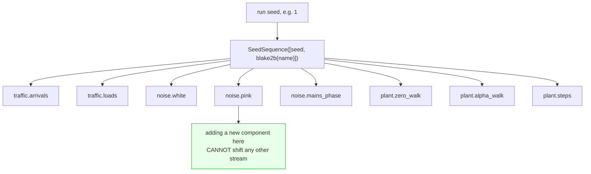
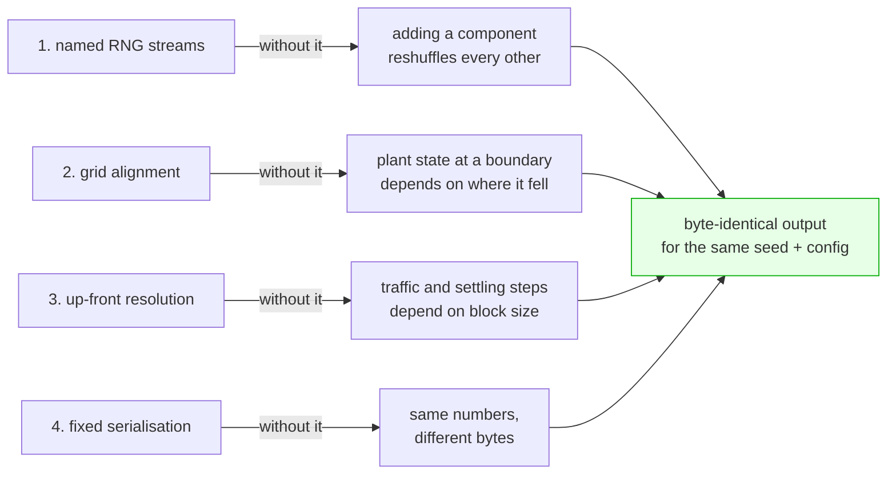

# Determinism

> Principle 4: same seed + same config => byte-identical output. This is a hard test, not an
> aspiration.

Determinism is not achieved by passing a seed around and hoping. Four mechanisms carry it, and each
one exists because a specific, easy failure mode exists without it.

---

## 1. Named RNG streams

Every stochastic component draws from its **own** generator, derived from the run seed and the
component's name:

```python
rng = streams(seed).get("noise.pink")
# seed sequence = SeedSequence([seed, blake2b(name)])
```



The child seed is a BLAKE2b digest of the component **name**, not a position and not Python's
salted `hash()`. Two properties follow and both are load-bearing:

- **Order independence.** Adding a stochastic component, or drawing a different number of values
  from an existing one, cannot move the numbers any other component sees. A single shared generator
  would shift everything downstream of the change; so would `SeedSequence.spawn()`, which is
  positional.
- **Stability across versions.** A digest of the name is the same in every process and every
  release, so a run from six months ago reproduces today.

This is what makes the governed-versus-ungoverned comparison valid at all: both arms run over a
**byte-identical** sample stream, so they differ in exactly one thing, and the difference can be
paired by seed and tested with a signed-rank test.

Two properties follow, and both are load-bearing.

**Order independence.** Adding a new stochastic component, or changing how many values an existing
one draws, cannot shift the numbers any other component sees. With a single shared generator, adding
one draw anywhere would change every subsequent value in the run — so a bug fix in the traffic
sampler would silently invalidate every previously recorded noise realisation, and no diff would show
why. `numpy`'s own `SeedSequence.spawn()` does not solve this either: it is *positional*, so
inserting a component in the middle renumbers everything after it.

**Cross-process stability.** The child seed is a BLAKE2b digest of the component name, not Python's
`hash()`, which is salted per process. A name-derived seed reproduces across machines, processes and
releases.

Tested by `test_named_streams_are_independent` and `test_stream_names_map_to_distinct_streams`.

### A trap this creates, and how it is handled

If one component draws *several different arrays* per block from the same stream, the interleaving of
those draws depends on the block size, and block-size invariance breaks. Two places would have hit
this and both use separate streams instead:

* `ThermalModel` — `temperature.weather` and `temperature.probe`
* `PinkNoise` — one `(n, M)` C-order draw per block rather than `M` separate `(n,)` draws, so
  concatenating two blocks gives exactly the numbers of one combined block

The same rule applies to anything added later: **one stream per array drawn per block.**

---

## 2. Grid alignment

`block_seconds` is expressed in seconds, not samples, and validated so that a block contains a whole
number of sample ticks, plant ticks *and* truth-log ticks. That is what lets a block boundary land
simultaneously on a plant-grid point and a truth-log row, which in turn is what lets the plant model
carry exact filter state across the boundary (`_plant_tail`) with nothing to interpolate over.

Without this, the plant state at a block boundary would depend on where the boundary fell.

---

## 3. Up-front resolution

Two things are resolved completely before generation starts, rather than discovered as it proceeds:

* the **traffic population** (`schedule_passes`) — every arrival time, speed, axle load and phase;
* the **settling step events** (`PlantModel._compile_steps`) — including the Poisson-generated ones.

Both would otherwise depend on how the run happened to be blocked.

---

## 4. Fixed serialisation

The four mechanisms, and what each one would break if it were absent:



`PARQUET_OPTIONS` pins compression (`zstd` level 3), format version and statistics. These are not
tuning knobs; changing them changes the bytes. Nothing time-varying is written into the data files —
wall-clock time appears only in `manifest.json` as `provenance.created_at`, which is deliberately
excluded from every hash.

---

## What exactly is guaranteed

| claim | holds | checked by |
|---|---|---|
| Same config + seed => identical file **bytes** | yes | `test_byte_identical_for_same_config` |
| Same config + seed => identical `output_hash` | yes | same |
| Different `block_seconds` => identical **values** | yes | `test_values_invariant_to_block_size` |
| Different `block_seconds` => identical **bytes** | **no** | — |
| Different seed => different data | yes | `test_different_seed_changes_the_data` |

The one negative result is worth being precise about: `block_seconds` also determines the parquet
row-group layout, so two runs that differ only in block size contain the same numbers in a different
physical arrangement. Every value is identical; the files are not. The docstring on
`ScenarioConfig.block_seconds` says so, and the test checks values rather than bytes.

Determinism is *not* claimed across:

* numpy, scipy or pyarrow major versions — a change in a distribution's sampling algorithm or in
  parquet encoding will change the bytes. `provenance.python_version` and the package versions in
  the lock file are what make a run reproducible in practice.
* platforms, for the same reason.

---

## Checking it yourself

```bash
wimsim generate S1_nominal --out /tmp/a -q
wimsim generate S1_nominal --out /tmp/b -q
wimsim verify-determinism /tmp/a /tmp/b
```

or `make determinism`.

---

## Provenance

Every artifact carries a `provenance` block: schema version, config hash, seed, mode, git commit,
git dirty flag, wimsim version, python version, platform, and `created_at`.

`git_dirty` is reported honestly. **If the working tree is dirty, the commit alone does not identify
the code that ran**, and the CLI says so after every generate. Treat dirty runs as non-citable: they
are fine for development and not fine for a table in a paper.
