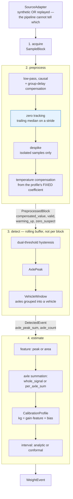
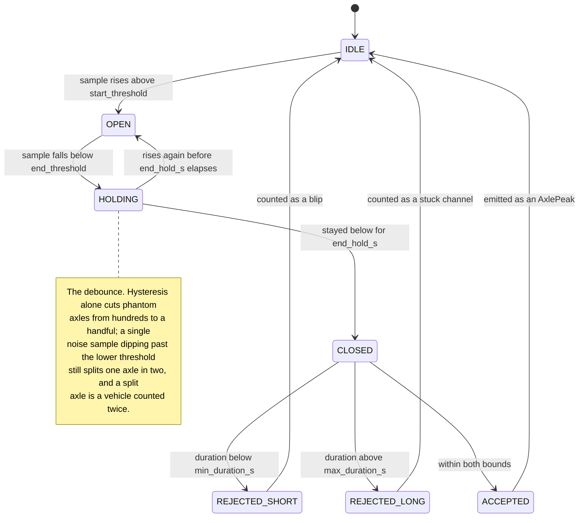

# The edge pipeline, and what phase 2 measured

`acquire -> preprocess -> detect -> estimate`, offline: no transport, no database.



Two things in that picture are load-bearing rather than incidental. The pipeline takes a
`SourceAdapter`, so it **cannot tell a synthetic stream from a replayed recording** — that is
principle 2, and it is why switching to real data is a config change. And it takes a
`CalibrationProfile` rather than fitting one, so **an event can always name the law that produced
it**.

`zero tracking` is highlighted because it is the hot path of the whole project: 61 % of a sweep run
sat there until it was rewritten. See `docs/experimenty-sk.md` section 6.3.

This document records the **measured** results of phase 2, including three findings that changed the
design. Numbers come from `S1_nominal` (900 s, 47 passes, clean conditions, no drift, no faults, no
body bounce) with 15 passes reserved to fit the calibration and 32 scored. Reproduce with:

```bash
wimsim generate S1_nominal --out data/synthetic/S1_demo
wimsim run data/synthetic/S1_demo --edge default
```

---

## Checkpoint result

| | `default` (peak) | `filtered` (peak, 500 Hz) | `area` |
|---|---|---|---|
| recall | 1.000 | 1.000 | 1.000 |
| false positives | 0 | 0 | 0 |
| axle-count accuracy | 1.000 | 1.000 | 1.000 |
| **MAE** | **1.43 kg** | 1.27 kg | 934 kg |
| MAPE | 0.054 % | 0.044 % | 9.58 % |
| RMSE | 2.12 kg | 1.92 kg | 1882 kg |
| bias | −0.10 kg | −0.89 kg | +850 kg |
| empirical coverage (nominal 0.95) | 0.906 | 0.938 | 0.688 |
| mean interval width | 5.9 kg | 5.5 kg | 584 kg |

Under clean conditions the peak path is limited only by the sample grid: 1.43 kg on vehicles
averaging 6.5 t is 0.054 %, and per-class MAE ranges from 0.91 kg (van) to 2.66 kg (rigid truck).

**This number means less than it looks like.** It is what the chain achieves with no drift, no
temperature change, no body bounce and a calibration fitted on the same conditions it is tested in.
Phases 3–5 exist because none of that holds in the field, and `S2`–`S7` are where the interesting
numbers come from.

---

## Finding 1: area loses to peak, by a factor of 650

The buildspec explicitly refuses to pre-decide peak versus area — "which one estimates mass better
under noise is an experimental question, not a design decision". Phase 2 answers it for the
single-sensor case, and the answer is not close.

Area is proportional to `load / speed`. **A single sensor cannot measure speed**: there is no second
point to time the vehicle against. So the speed spread in the traffic — 75 to 128 km/h in this run —
lands directly and unmitigated in the mass estimate. The relative error correlates with speed at
−0.41 and spans −22 % to +27 %.

This is a property of the instrument, not of the implementation, and it will not improve with a
better estimator. What would change the answer:

* a **second sensor** at a known spacing, making speed observable — the standard commercial fix;
* **axle-spacing inference**: the detector already exposes `axle_dt_s`, and an assumed spacing per
  vehicle class turns those into a speed. Worth trying in phase 6, and it can only work for
  multi-axle vehicles that have been classified correctly.

Until then, `peak` is the default and `area` exists so the comparison can be re-run as a config
sweep rather than argued about.

---

## Finding 2: the despiker was eating vehicles

The first implementation lost **19.8 % of a car's peak** and 0.6 % of a truck's. On `S1_nominal`
that showed as 114 kg MAE against 1.43 kg without despiking.

A Hampel filter flags samples that depart from their local median by more than a few robust noise
deviations. That works when the pulse is much wider than the median window. When they are
comparable — a 5.3 ms car pulse is 10.6 samples at 2 kHz, against an 11-sample window — the median
at the peak sits near half maximum, the peak trips the outlier test, and the despiker replaces the
top of the vehicle with the middle of it.

A run-length guard was already present, releasing flagged runs longer than half the window. It did
not fire: exactly five samples were flagged and exactly five were permitted. The guard now releases
runs longer than `despike_max_run` (default 2), which is what "a spike is isolated" actually means.

**Why this mattered more than its size suggests:** the damage scaled with pulse width, so it hit
fast vehicles harder than slow ones. That converts the peak feature — whose entire justification is
speed invariance — into a speed-dependent one. A uniform 20 % loss would have been absorbed by the
fitted gain and invisible.

### A limitation that remains, deliberately

A spike landing on a steep pulse flank is **not** removed. Over an 11-sample window the flank of a
real pulse already departs from its own median by far more than six noise deviations, so the flank
is flagged too and the guard releases the whole run, spike included. The alternative is to trust the
flags and eat the pulse.

For a weighing instrument that trade is not close: a missed spike degrades one event, an eaten peak
biases every event and does so more for fast vehicles than slow ones. Pinned by
`test_a_spike_on_a_steep_flank_is_deliberately_left_alone`.

### And one more

With a genuinely noiseless signal the robust scale estimate is zero, and despiking switches itself
off rather than declaring every deviation infinitely significant. Reachable in practice — a stuck
ADC reports a constant.

---

## Finding 3: the low-pass cutoff must clear the pulse band by a wide margin

A 5.3 ms car pulse has a −3 dB bandwidth of roughly 83 Hz, so 120 Hz looks generous. Measured, on
the peak path with despiking disabled:

| cutoff | MAE | MAPE |
|---|---|---|
| 60 Hz | 264.27 kg | 5.17 % |
| 120 Hz | 32.96 kg | 1.47 % |
| 250 Hz | 2.47 kg | 0.091 % |
| 500 Hz | 1.27 kg | 0.044 % |
| 800 Hz | 1.22 kg | 0.050 % |
| none | 1.43 kg | 0.054 % |

The peak depends on spectral content well past the −3 dB point, and a 4th-order Butterworth
attenuates a narrow pulse more than a wide one — the same speed-dependence failure as the despiker,
by a different route.

At 500 Hz the filter is marginally *better* than no filter, because it removes white noise above the
signal band while leaving the narrowest pulse intact. **Rule of thumb: keep the cutoff at least
three times the bandwidth of the fastest vehicle's pulse.** `configs/estimators/filtered.yaml`
carries 500 Hz and the table above.

Note this makes `filtered` invalid at the 500 Hz endurance station, where 500 Hz is Nyquist. The
constructor rejects it rather than silently clamping.

---

## Finding 4: the analytic interval is already visibly optimistic

Empirical coverage is **0.906 against a nominal 0.95** on the peak path, and **0.688** on the area
path. With 32 scored passes the peak figure is within binomial sampling error; the area figure is
not.

The interval is the fit's residual standard deviation scaled by a normal quantile, which is honest
only when residuals are Gaussian, independent and homoscedastic. The area path's residuals are
none of those — they are driven by speed, so they are structured and load-dependent, and the
interval is both far wider *and* less trustworthy than the peak path's.

An interval whose width is honest but whose coverage is not is the worst of both. This is the
concrete case for split conformal prediction in phase 5, which needs no distributional assumption,
and `interval_source` is already recorded on every event so the two can be compared rather than
merely swapped.

---

## Design notes

### Causality, and what group-delay compensation may and may not do

A station cannot look into the future, so filtering is causal: no `filtfilt`, no centred windows.
That costs group delay.

Compensating it by shifting sample *values* earlier would reintroduce exactly the clairvoyance just
refused — the output at *t* would depend on the input at *t + delay*. What a station can do is stamp
a filtered sample with the time the underlying event actually happened and pay `delay` seconds of
latency. So **the time axis is corrected and the sample array is not**. `group_delay_s` is reported
either way.

### The zero line is a trailing median

Recomputed on a stride keyed to the **global** sample index — so where updates fall does not depend
on how the stream is blocked — and held constant in between, so the estimate at any instant depends
only on the past.

A median rather than a mean because it is exactly unbiased for symmetric noise and completely immune
to vehicles while they occupy less than half the window. When they do not, `zero_suspect` fires. That
flag cannot be computed from the median, which would already be contaminated, so it comes from low
quantiles, which survive up to 75 % contamination.

Invalid samples enter the history as NaN rather than being dropped: a stuck channel must not drag
the baseline to wherever it got stuck, and the history must stay aligned in time.

### The detector needs both hysteresis and a debounce

A signal hovering on the start threshold crosses it on half of all samples. Collapsing the two
thresholds yields hundreds of phantom axles from one excursion; the hysteresis gap cuts that to a
handful. A handful is not zero — at a 3.5σ gap a single sample still dips past the lower threshold
every few thousand samples and splits one axle in two, and a split axle is a vehicle counted twice.
`end_hold_s` requires the signal to stay below for a couple of milliseconds before closing.

The window therefore has four states and three ways to be thrown away, and **both rejections are
counted** — a detector that silently discards things cannot be debugged from a dashboard:



The buffer is rolling rather than per-block because a window can open in one block and close three
blocks later, the walk-back to the start of an excursion can cross a boundary, and the padded area
integral needs samples from before the window opened. `test_results_do_not_depend_on_block_size`
is the test that holds this.

### The peak feature is the sum of axle peaks

`DetectedEvent.peak` is the largest axle, reported as the schema's `compensated_peak`: an
instantaneous force, and the right quantity for an overload threshold. It is **not** a mass proxy. A
vehicle's mass is carried by all its axles, so the feature is `axle_peak_sum`. Conflating the two
would weigh every truck as though it were its heaviest axle.

### Detection is exact under clean conditions, and that is not a strong claim

Recall 1.000, zero false positives, axle counts exactly right. Worth stating plainly: with 3 s
minimum headway, pulses that are hundreds of noise deviations tall, and no dropouts, detection is
easy. `S5` (dropouts), `S6` (everything at once) and `S7` (600 veh/h, 2 s headway) are where the
detector will actually be tested.

---

## Configuration

Pipeline settings live in `configs/estimators/` and load independently of the run, because the same
settings must apply to a synthetic scenario and to a replayed recording, and an experiment sweeps
the two axes separately.

```bash
wimsim pipelines                                     # what is available
wimsim run <run_dir> --edge area                     # swap the feature
wimsim run <run_dir> --edge filtered \
  --set edge.preprocess.cutoff_hz=250.0              # sweep without writing a file
```

`--set` requires the key to already exist in the resolved config — `cutoff_hz` cannot be overridden
on `default`, which does not filter — so a typo is an error rather than a silently ignored setting.

## Calibration in phase 2

`StaticAffine` must be fitted before it can predict, and in the field that fit comes from reference
vehicles of known mass. Offline the equivalent is a **calibration split**: the first
`bootstrap_passes` vehicles have their masses read from the truth log and handed to the estimator as
`ReferenceObservation`s, exactly as a known reference vehicle would be. Everything after the split
is scored, so no pass is ever both training and test data.

One pass over the stream suffices, and the reason will stop being true. Feature extraction depends
on the active profile only through temperature compensation, and `StaticAffine` does not fit a
temperature coefficient — so the bootstrap profile and the fitted one compensate identically and the
features do not move. Phase 5's estimators do adapt their coefficient and will need two passes.
