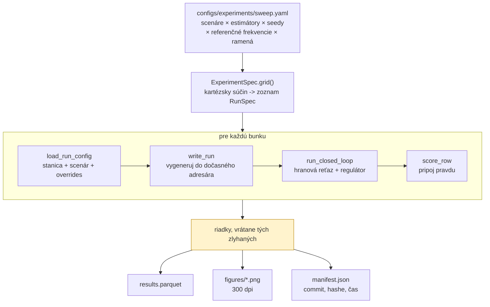
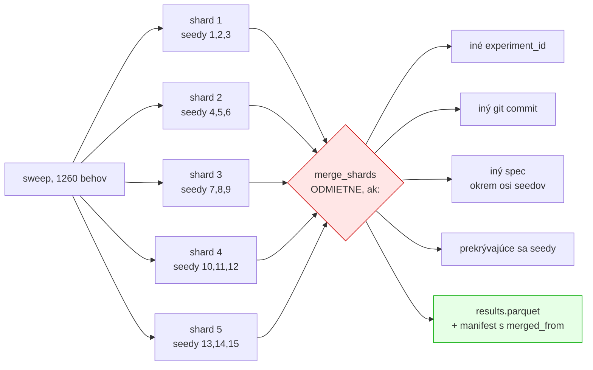
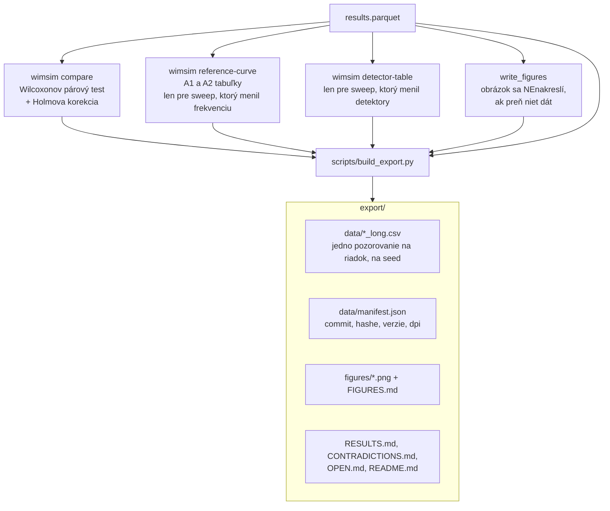
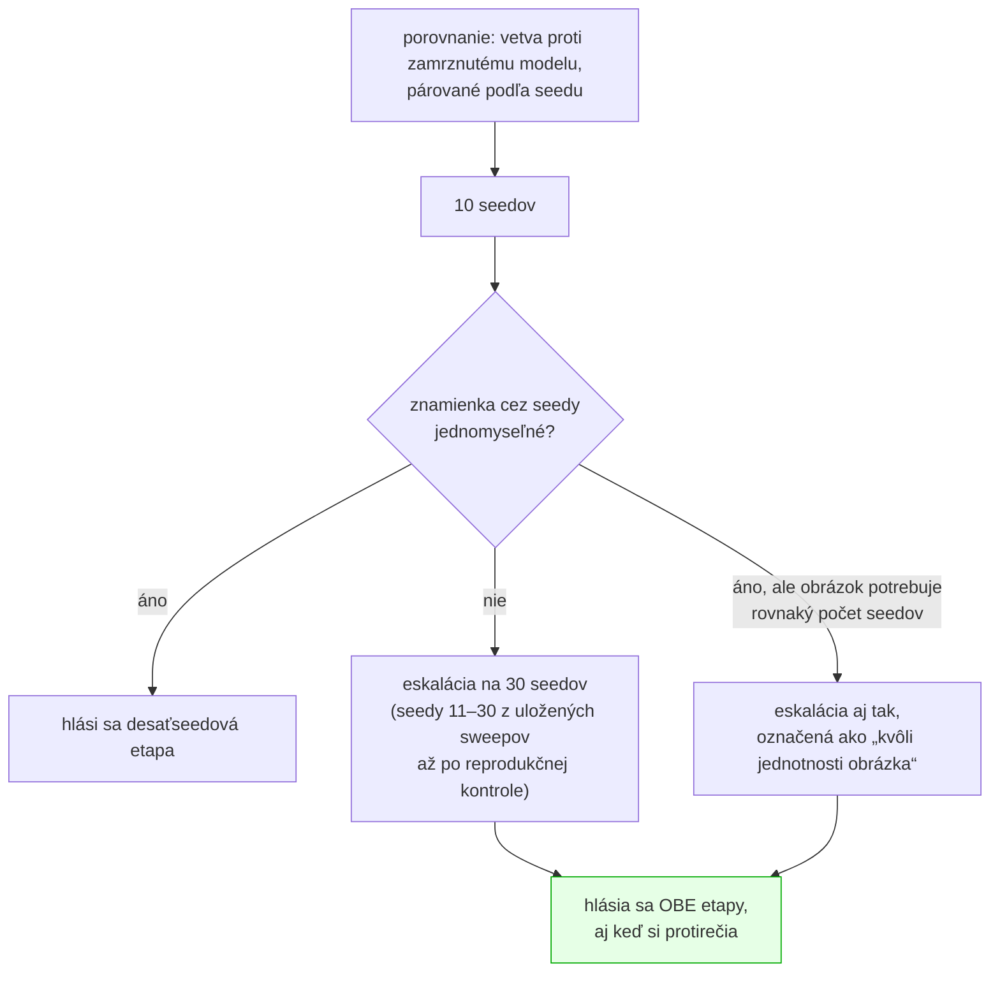
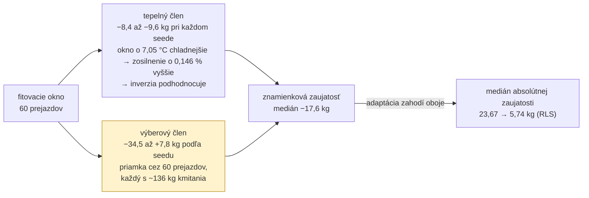
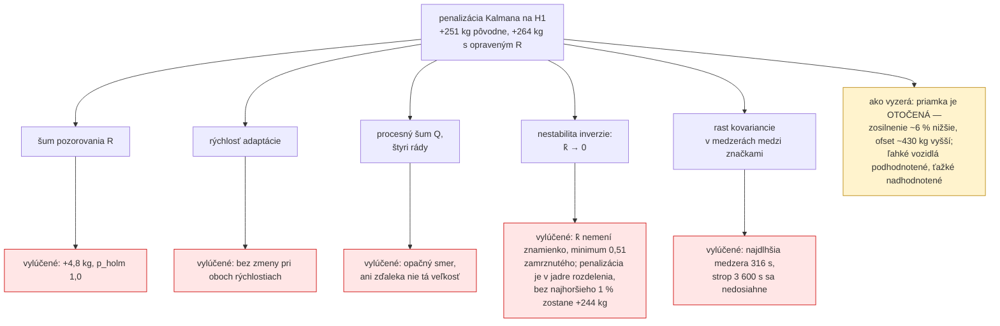

# Ako sa experimenty púšťali a vyhodnocovali

Doplnok k [`simulacia-sk.md`](simulacia-sk.md), ktorý popisuje samotný model. Tento dokument je o
vrstve nad ním: ako sa z jedného behu stane sweep, ako sa sweep rozdelí na stroje, ako sa výsledky
spoja a ako sa z nich stane číslo, ktoré smie ísť do článku.

---

## 1. Čo je „beh“ a čo je „sweep“

**Beh** je jedna bunka mriežky: jeden scenár × jeden estimátor × jeden seed × jedna referenčná
frekvencia × jedno rameno regulátora. Vyprodukuje **jeden riadok** s 48 stĺpcami.

**Sweep** je deklaratívna mriežka v `configs/experiments/*.yaml`. Beží cez
`wimsim experiment <meno>` a zapíše `results.parquet`, `results.md`, `results.tex`,
`manifest.json` a adresár `figures/`.



**Bunka, ktorá zlyhá, sa stane riadkom, ktorý to hovorí** — nezhodí sweep a ani ticho nezmizne.
Zahodiť ju by zmenilo, nad čím je každý priemer v tabuľke priemerom.

---

## 2. Rozdelenie na shardy a spätné spojenie

Sweep s 2 520 behmi trvá na tomto stroji desiatky hodín ako jeden proces. Jediná os, ktorá sa delí
**presne**, je os seedov: ten istý seed dá bajt po bajte rovnaký prúd vzoriek bez ohľadu na to, kde
beží, takže shardy sa zreťazia do presne toho, čo by vyprodukoval jeden proces.



Kontrola prekrytia seedov je dôležitejšia, než vyzerá: **determinizmus robí duplikovaný beh
identickým**, a práve to spôsobuje, že by dvojité započítanie bolo neviditeľné. Žiadny medián by
nevyzeral podozrivo; iba by bol vážený smerom k zdvojenému seedu.

Výnimka pri kontrole špecifikácie je os seedov — `--seeds 1,2,3` a `--seeds 4,5,6` zapíšu odlišné
`spec.seeds`, a kontrola, ktorá by to nevyňala, by odmietla každý skutočný shard. Presne tak táto
kontrola aj zlyhala, keď prvýkrát stretla tri shardy, pre ktoré bola napísaná.

---

## 3. Od riadkov k tvrdeniu



### 3.1 Prečo párový test a nie t-test

Behy sú **párované podľa seedu**. Ten istý seed dá bajt po bajte identický prúd vzoriek, takže
rameno so zapnutým a vypnutým regulátorom sa líši presne v jednej veci. To je presne nastavenie,
pre ktoré je znamienkovo-poradový test stavaný.

Wilcoxon a nie t-test, lebo nič tu nie je známe ako normálne a viaceré rozdelenia viditeľne nie sú.
Holm a nie Bonferroni, lebo Holm je rovnomerne silnejší pri rovnakej rodinnej chybovosti.

**Rodinu deklaruje volajúci, explicitne.** Korigovať cez „všetky testy, ktoré som spustil“ a cez
„sedem scenárov v tejto tabuľke“ sú rôzne tvrdenia, a ktoré z nich sa robí, musí byť rozhodnutie,
nie náhoda.

### 3.2 Čo počet seedov vôbec dovoľuje

Najmenšie dosiahnuteľné obojstranné *p* je `2 / 2ⁿ`:

| seedy | podlaha *p* | čo z toho plynie |
|---:|---:|---|
| 3 | 0,25 | **nič nemôže dosiahnuť 0,05**, nech je efekt akokoľvek veľký. Tieto sweepy sú popisné a sú tak aj označené |
| 10 | 0,00195 | prejde cez korekciu v malej rodine |
| 15 | 6,1·10⁻⁵ | prejde cez 42-testovú rodinu |
| 30 | < 10⁻⁸ | pohodlne |

Toto nie je formalita. V tomto projekte sa už stalo, že trojseedový výsledok bol skreslený **a v
jednej bunke mal opačné znamienko**: `cintron_ladder` pri troch seedoch hlásil −13,66 kg tam, kde
tridsať seedov hlási +9,60 kg a signifikantne horšie. A pri poslednom sweepe trojseedová detekčná
recall 0,000 pri jednej referencii na dvadsať vyšla pri pätnástich seedoch ako 0,200 — tie nuly
boli **výberové**, nie štrukturálne.

Pravidlo, ktoré z toho platí: **ak silnejší beh protirečí slabšiemu, tá protirečivosť je ten
nález.**

### 3.3 Odmietnuť radšej než spriemerovať

Viaceré redukcie radšej vyhodia výnimku, než by vrátili číslo, ktoré vyzerá použiteľne:

- `compare` **odmietne** párovanie, ak je voľná os, ktorú párovanie nezohľadňuje — inak by sa
  rozdiel bral voči ľubovoľnému z dvoch riadkov.
- `reference-curve` **odmietne** sweep, ktorý bežal na jednej referenčnej frekvencii: obe
  relácie, ktoré hlási, sú tvary voči tej frekvencii, a jednobodová krivka by sa čítala ako trend.
- `detector-table` **odmietne** sweep s jedným ramenom detektora, lebo spriemerovaný cez scenár by
  sa z piatich ramien stal jeden riadok opisujúci ensemble pod hlavičkou tvrdiacou, že ich
  porovnáva.
- Recall na scenári bez vloženej poruchy je **nedefinovaný, nie nulový**. Detektor nemôže minúť
  niečo, čo tam nikdy nebolo, a tabuľka, ktorá do tej bunky napíše 0,000, hovorí opak toho, čo sa
  stalo.

---

## 4. Čo sa reálne spustilo

Export stojí na **14 sweepoch a 4 454 behoch**, čo je 138 074 pozorovaní v dlhom formáte.

| sweep | behy | seedy | na čo |
|---|---:|---:|---|
| `ladder` | 63 | 3 | každý estimátor cez každý skórovateľný scenár |
| `ladder30` | 630 | 30 | to isté pri tridsiatich seedoch — prvé testy signifikancie |
| `cintron_ladder` | 63 | 3 | tie isté scenáre na fyzike **reálneho** prístroja |
| `cintron_ladder30` | 630 | 30 | to isté pri tridsiatich seedoch |
| `reference_rate` | 180 | 3 | referenčná frekvencia × rameno regulátora, Page-Hinkley 15,0 |
| `reference_rate_ph75` | 180 | 3 | to isté pri opravenom prahu 7,5 |
| `reference_rate30` | 1 260 | 15 | sedem frekvencií vrátane „každé vozidlo“, pri sile |
| `heldout30` | 360 | 30 | **štyri scenáre, na ktorých sa nič neladilo** |
| `ablation` | 150 | 10 | S6 s každou triedou poruchy postupne odstránenou |
| `governance` | 18 | 3 | slučka zapnutá/vypnutá na S6 |
| `detectors` | 100 | 10 | štyri detektory samostatne plus ensemble |
| `detector_thresholds` | 340 | 10 | 17 prahových ramien — zvyšok krivky recall/falošné poplachy |
| `recal_coverage` | 300 | 10 | frekvencia rekalibrácie proti pokrytiu intervalu |
| `theta2` | 180 | 30 | trojparametrická mapa proti dvojparametrickej |

Mimo sweepov: `wimsim validate-sim` — krížová validácia parametrov simulátora metódou „vynechaj
jeden záznam“ nad ôsmimi reálnymi nahrávkami.

### 4.1 Revízia článku (4. – 6. 10. 2026)

Revízia pridala **3 265 behov**, žiadny nezlyhal. Najprv auditné etapy A–F (1 170 behov), potom
sweepy `p1_*` (2 000 behov), 55 kontrolných opakovaní a 40 inštrumentovaných diagnostických behov:

| skupina | sweepy | behy | na čo |
|---|---|---:|---|
| auditné etapy | `blocking`, `reference_rate_fixed`, `sparse_tuning`, `kalman_q` | 1 170 | blokujúci regulátor, okno potvrdenia, riedke referencie, procesný šum Q |
| pamäť | `p1_mem_*`, `p1_esc_periodic_*` | 820 | periodické prefitovanie a rastúce okno (λ = 1) |
| faktor zabúdania | `p1_lambda*`, `p1_esc_lambda*` | 350 | λ ∈ {0,95; 0,995; 0,999} na S2, S4, S7 a preladená pamäť na H1, H2 |
| opravené R | `p1_r_*_floor*` | 480 | Kalman s R odvodeným z rozptylu dynamického zaťaženia |
| preškálované Q | `p1_kq_*` | 330 | opravené R pri pôvodnom pomere Q/R |
| reprodukčné kontroly | `p1_esc_repro`, `p1_esc_lambda_fill_repro` | 20 | nový commit musí presne zopakovať uložené behy |
| kontrolné ramená | `p1_r_cin`, `p1_r_dev`, `p1_r_held` | 55 | zastavené po bitovej zhode s uloženými sweepmi |
| diagnostika H1 | `scripts/h1_diagnostics.py` | 40 | stav estimátora pri každom vozidle |

Článok sa opiera o **3 765 behov**: `ladder30`, `cintron_ladder30`, `heldout30`, `kalman_q`, všetky
sweepy `p1_*`, 55 kontrolných opakovaní a 40 diagnostických behov. Čiastočné spojenia
(`*_s1_2` atď.) sa nepočítajú dvakrát.

---

## 5. Prahy Page-Hinkleyho, čiže prečo sa sweepy nedajú miešať

Odoslaná predvoľba bola **15,0** pre každý sweep okrem troch, a po `detector_thresholds` sa
presunula na **7,5**. Nič sa spätne nepreháňalo: **tá prahová krivka je sama výsledok**, a
prebehnúť všetko v jednom opravenom bode by zakrylo, ako sa našiel.

Dôsledok, ktorý treba povedať nahlas: konfigurácie starších sweepov stále hovoria
`edge_config: default`, a tá predvoľba sa dnes rozvinie na 7,5. **Ich spustenie dnes nezreprodukuje
uložené čísla.** Nesúlad je detegovateľný, nie tichý — každý riadok nesie `edge_config_hash` a ten
sa bude líšiť.

Preto novšie konfigurácie prah **pripínajú explicitne**: súbor, ktorý si zapíše vlastný pracovný
bod, znamená o rok to isté, čo znamená dnes.

---

## 6. Časy behu

Všetky čísla nižšie sú **namerané**, nie odhadnuté, a pochádzajú z `manifest.json` každého sweepu.

### 6.1 Ako čítať `elapsed_s`

Jedna vec sa dá ľahko prečítať zle. Pri sweepe, ktorý bežal po shardoch, je `elapsed_s` v
zlúčenom manifeste **súčet cez shardy**, nie hodiny na stenách — `merge_shards` ich jednoducho
spočíta. Shardy bežia súbežne, takže nástenný čas je približne `súčet / počet shardov`. Obe čísla
sú užitočné a nie sú to to isté: súčet hovorí, koľko strojového času to stálo, podiel hovorí, ako
dlho sa čakalo.

| sweep | behov | shardov | súčet | nástenný čas | s/beh |
|---|---:|---:|---:|---:|---:|
| `ladder` | 63 | 1 | 1,0 h | 1,0 h | 59 |
| `ladder30` | 630 | 3 | 37,0 h | ~12,3 h | 211 |
| `cintron_ladder` | 63 | 1 | 4,2 h | 4,2 h | 238 |
| `cintron_ladder30` | 630 | 5 | 35,6 h | ~7,1 h | 204 |
| `reference_rate` | 180 | 1 | 1,7 h | 1,7 h | **35** |
| `reference_rate_ph75` | 180 | 3 | 7,4 h | ~2,5 h | 148 |
| `reference_rate30` | 1 260 | 5 | **28,3 h** | ~5,7 h | 81 |
| `heldout30` | 360 | 10 | **22,8 h** | ~2,3 h | 228 |
| `ablation` | 150 | 5 | **8,9 h** | ~1,8 h | 213 |
| `governance` | 18 | 1 | 0,6 h | 0,6 h | 111 |
| `detectors` | 100 | 1 | 7,4 h | 7,4 h | 268 |
| `detector_thresholds` | 340 | 5 | 21,8 h | ~4,4 h | 231 |
| `recal_coverage` | 300 | 1 | 17,6 h | 17,6 h | 211 |
| `theta2` | 180 | 1 | 15,9 h | 15,9 h | 318 |
| revízia: pamäť (`p1_mem_*`, `p1_esc_periodic_*`) | 820 | 4–5 | 29,9 h | — | 131 |
| revízia: faktor zabúdania (`p1_lambda*`, `p1_esc_lambda*`) | 350 | 1–5 | 17,3 h | — | 178 |
| revízia: opravené R (`p1_r_*_floor*`) | 480 | 4–5 | 28,5 h | — | 214 |
| revízia: preškálované Q (`p1_kq_*`) | 330 | 4–5 | 14,3 h | — | 156 |
| revízia: reprodukčné kontroly | 20 | 1 | 0,5 h | 0,5 h | 96 |

Revízne sweepy spolu: **2 000 behov, 90,5 h strojového času**. Nástenný čas sa pre ne neuvádza,
pretože časť z nich bežala súbežne v jednej fronte (`xargs -P 8` nad príkazmi
`wimsim experiment`). Podiel súčet/shardy by preto nehovoril, ako dlho sa na ktorý sweep čakalo.

**Stĺpec „s/beh“ sa nedá porovnávať naprieč riadkami** a je tu napriek tomu, lebo bez neho sa
nedá prečítať nič ostatné. Líšia sa v troch veciach naraz: dĺžkou scenára (S1 má 6 h, S6 má 48 h
simulovaného času), počtom súbežných shardov, a tým, či sweep bežal pred alebo po optimalizácii
z §6.3. Posledné tri sweepy — `reference_rate30`, `heldout30`, `ablation` — sú jediné, ktoré bežali
na optimalizovanom kóde.

### 6.2 Paralelizmus tu nefunguje a je to zmerané

Tento stroj udrží približne **2,8 behu za minútu bez ohľadu na počet shardov**:

| súbežných procesov | behov/min |
|---:|---:|
| 1 | 1,7 |
| 5 | 2,79 |
| 10 | 2,6 |

Desať shardov teda nie je rýchlejších ako päť — nameraný rozdiel 2,6 oproti 2,79 je síce v
pásme merania, ale **zrýchlenie z neho nevyšlo žiadne**, a to je tvrdenie, ktoré to meranie unesie.
Pri desiatich procesoch bolo vyťaženie 7,5 jadra z dvanástich logických a **disk nečinný na 0,5 %** — záťaž je teda viazaná šírkou pásma pamäte, nie
procesorom ani vstupom/výstupom. Pridávanie procesov iba rozdeľuje pevnú priepustnosť na menšie
kúsky.

To je dôvod, prečo sa posledný sweep púšťal na piatich shardoch a nie na desiatich, a prečo sa
`heldout30`, `ablation` a `reference_rate30` púšťali **sekvenčne za sebou** a nie súbežne: celková
práca je rovnaká, ale sekvenčne je prvý z nich hotový za dve hodiny namiesto za deväť.

Druhé pozorovanie z toho istého merania: **cena behu je plochá voči referenčnej frekvencii**.
Beh pri jednej referencii na vozidlo trvá rovnako dlho ako beh pri jednej na päťdesiat, hoci robí
päťdesiatnásobok kalibračnej práce. Cenu teda určuje **generovanie signálu**, nie estimátor ani
regulátor.

### 6.3 Kde ten čas sedel a čo sa s tým dalo urobiť

Profilovanie ukázalo **61 %** času behu vnútri `Preprocessor._track_zero`, a väčšina z toho nebola
aritmetika — bola to Pythonovská réžia `np.quantile`, volaného 230 000-krát na beh nad trojprvkovým
poľom kvantilov. Jedna particia teraz obsluhuje všetky štyri poradové štatistiky:

| ten istý 16-hodinový beh S4 | čas |
|---|---:|
| pred optimalizáciou, sólo | **61,1 s** |
| po optimalizácii, sólo | **38,7 s** |
| pod 10-násobnou záťažou | ~3,8 min |

Priepustnosť tým stúpla z ~2,8 na **~4,4 behu za minútu**. Detaily a dôkaz bitovej zhody sú v
[`simulacia-sk.md` §10](simulacia-sk.md#10-výkon).

Jedna poznámka k profilovaniu samotnému: prvý profil bol **nepoužiteľný**, pretože hodinový beh
trval 17,5 s, z toho ~14 s zabral import `scipy`. Pri sweepe sa import zaplatí raz na proces a
amortizuje sa cez stovky behov, takže v profile vyzeral ako dominantná položka a nebol ňou. Druhý
profil si importy zaplatil dopredu.

### 6.4 Testy

| beh testovej sady | čas |
|---|---:|
| voľný stroj | ~185 s |
| súbežne s desiatimi workermi | **884 s** (14 min 44 s) |

Raz ju systém pri tejto záťaži aj **zabil pre nedostatok pamäte** — desať workerov drží okolo
3,1 GB a pytest potrebuje svoje. Praktický záver: plná sada sa púšťa, keď je stroj voľný, a počas
sweepov sa púšťajú len cielené súbory.

### 6.5 Čo z toho plynie pre plánovanie

- **Odhadni nástenný čas ako `počet_behov × s/beh_podobného_sweepu ÷ počet_shardov`** a potom to
  vynásob 1,3, lebo kontencia nie je lineárna.
- **Viac ako päť shardov nemá zmysel.** Pevná priepustnosť znamená, že desiaty shard iba spomalí
  prvých deväť.
- **Shard zapisuje výsledky až na konci.** Zabitý shard na 90 % je zabitý shard na 0 %, takže
  pri nedostatku času je lepšie dobehnúť menej seedov úplne než viac seedov spolovice. Preto
  `reference_rate30` bežal pätnásť seedov a nie tridsať — pätnásť je hotových a použiteľných,
  tridsať by bolo rozbehnutých.
- **Keď optimalizácia stojí hodinu práce a ušetrí štyri hodiny strojového času, oplatí sa** — ale
  iba vtedy, ak sa dá dokázať, že nemení výsledky. Tu sa to dokázať dalo, a preto sa spravila.

---

## 6a. Protokol revízie a čo sa naučilo o provenancii

Pravidlo o počte seedov bolo zapísané do gitu **pred prvým revíznym behom** (commit `459d583`):



Štatistika je **medián párových rozdielov** (vetva mínus zamrznutý model; záporné číslo je v
prospech adaptácie), nikdy nie rozdiel mediánov. Holmova korekcia sa robí v deklarovanej rodine a
korigované *p* sa uvádza spolu s ňou. To isté pozorovanie totiž môže v jednej rodine prejsť a v
druhej nie: S2 pri λ = 0,99 má surové *p* = 0,029, v štrnásťtestovej rodine `ladder30` 0,198 a v
pätnásťbunkovej rodine prehľadávania pamäte 0,029.

Tri desaťseedové výsledky tridsiatku neprežili: „periodické prefitovanie je na S2 horšie než
zamrznutý model“, „výnimka Kalmana na S6 sa vracia pri pôvodnej rýchlosti“ a „λ = 0,999 poráža
λ = 0,99 na H1“.

**Tri poučenia o provenancii:**

- **Aj nesledovaný súbor urobí beh „špinavým“.** `git_state()` volá `git status --porcelain` v
  repozitári, z ktorého je balík nainštalovaný. Rozpracovaný analytický skript kdekoľvek v strome
  preto označí každý práve bežiaci beh. Samostatný worktree nepomôže, pečiatka ide za
  nainštalovaným balíkom, nie za pracovným adresárom. Takto je označených päť behov (S2, λ = 0,95,
  seedy 26–30). Zdrojový kód aj konfigurácie boli overené ako nezmenené a opakovaný beh sa zhodoval
  vo všetkých výsledkových poliach. Počas fronty patria analytické výstupy do ignorovaného
  `data/results/`.
- **Uložená vetva sa smie použiť až po reprodukcii.** Eskalácie berú seedy 11–30 z uložených
  sweepov, ale až keď reprodukčná kontrola pri novom commite dá presne tie isté čísla (12/12 a 8/8
  riadkov, max |Δ| = 0).
- **Inštrumentácia musí zopakovať uložené číslo.** Obalený estimátor, ktorý zmení jedinú operáciu s
  pohyblivou čiarkou, je iný experiment. Diagnostika H1 to pri každom behu overuje tvrdením
  (*assert*) proti skóre uzavretej slučky aj proti uloženému sweepu.

---

## 6b. Čo revízia zistila

Úplný záznam je v [`REVISION_LOG.md`](../REVISION_LOG.md). Tabuľky sú v `export/data/p1/` a každý
obrázok článku má v `export/figures/` sprievodný súbor, ktorý menuje vykreslenú štatistiku.
Anglický prehľad je v [`experiments.md`](experiments.md#the-revision-memory-length-the-noise-model-and-the-floor).

**Dĺžka pamäte je prvoradá.** RLS mínus zamrznutý model, medián párových rozdielov v kg, 30 seedov:

| scenár | prebytok | λ = 0,95 | 0,99 | 0,995 | 0,999 | 1,0 |
|---|---:|---:|---:|---:|---:|---:|
| S2 pomalý | 2,7 | **+4,13** | −0,80 | −1,22 | −1,47 | **−1,48** |
| S4 skokový | 46,0 | **−35,5** | −27,1 | −23,3 | −20,6 | −19,9 |
| S7 rampa, riedke značky | 20,7 | −11,8 | **−14,1** | −12,0 | −6,5 | −4,7 |

Každý scenár chce inú pamäť: skokový drift najkratšiu, pomalý najdlhšiu a rampa s riedkymi
značkami strednú. Na S2 sa znamienko otáča, krátka pamäť stojí viac než celý dostupný prebytok.
Všetky čísla na S2 sú pod 0,1 % priemernej hmotnosti vozidla (6 283 kg). Zistením je otočenie
znamienka, nie praktický dopad na váženie.

**Šumový model Kalmana: R trochu, Q/R veľa.** Správne R (2,933 × 10⁻³ namiesto 1,0 × 10⁻⁸) prinesie
0,25–3 kg, rýchlosť adaptácie 10–25 kg. Najprv treba prejsť pamäť, potom ladiť šumový model.

**Zaujatosť zamrznutého modelu na S2 sa dá zrekonštruovať.** Nový fit na prvých 60 uložených
prejazdoch zopakuje uloženú zaujatosť každého seedu (r = 0,996) a rozloží ju na dve časti:



Pokles absolútnej zaujatosti je teda hlavne zahodenie výberovej chyby malého okna. Tepelný posun
z neho tvorí asi 9 kg. Skoršie „+9,2 kg“ bol posun zosilnenia, nie zaujatosť. Ako zaujatosť má
opačné znamienko.

**Penalizácia Kalmana na H1 zostáva nevysvetlená, ale zoznam vylúčeného sa predĺžil:**



Prečo sa filter usadí práve v tomto otočení, nevieme.

**Podlahu nevieme odhadnúť vopred.** Literárny koeficient dynamického zaťaženia (0,05–0,3 na
nápravu; pôvodnú vetu sme z prvej ruky nečítali) podlahu nadhodnotí a otočí rozhodnutie na S4 a S7.
Dvadsať opakovaných prejazdov jedného kamióna ju podhodnotí o 10–33 % a otočí S2, S3 a S5 opačným
smerom. Orákulovú podlahu so skutočnými časovo premennými parametrami nebolo z čoho spočítať,
pretože žiadny beh neukladá predikcie po jednotlivých vozidlách.

---

## 7. Reprodukcia

```bash
# jeden sweep, jeden proces
wimsim experiment ladder30 --out data/results/ladder30

# ten istý sweep po shardoch, keď sa ponáhľa
wimsim experiment reference_rate30 --seeds 1,2,3   --out data/results/reference_rate30_s1
wimsim experiment reference_rate30 --seeds 4,5,6   --out data/results/reference_rate30_s2
# ...a potom spojiť cez wimsim.experiments.merge.merge_shards

# čo sa spustí, bez toho, aby sa čokoľvek spustilo
wimsim experiment reference_rate30 --dry-run

# analýzy nad hotovým sweepom
wimsim compare          data/results/reference_rate30
wimsim reference-curve  data/results/reference_rate30
wimsim detector-table   data/results/detector_thresholds

# krížová validácia simulátora proti reálnym nahrávkam
wimsim validate-sim data/real --channel Tenzo2 --out data/results/sim_crossval

# prestavba celého exportu
python scripts/build_export.py
```

Overenie determinizmu — vygeneruj ten istý beh dvakrát a porovnaj hashe súborov:

```bash
wimsim generate S1_nominal --out /tmp/a --seed 1
wimsim generate S1_nominal --out /tmp/b --seed 1
wimsim verify-determinism /tmp/a /tmp/b
```

Porovnáva `samples.parquet`, `truth_passes.parquet` a `truth_timeseries.parquet` po bajtoch, plus
`config_hash` a `output_hash` z oboch manifestov.

Revízne analýzy a obrázky článku:

```bash
# eskalačná etapa: seedy 11–30 po shardoch; reprodukčná kontrola ide pred ňou
wimsim experiment p1_esc_lambda_fill --seeds 1,2 --out data/results/p1_esc_lambda_fill_repro
wimsim experiment p1_esc_lambda_fill --seeds 11,12,13,14,15 --out data/results/p1_esc_lambda_fill_s11

# obrázky článku a ich sprievodné súbory (export/figures/*.md)
python scripts/paper_figures.py

# diagnostika H1 a rozklad zaujatosti S2
python scripts/h1_diagnostics.py --arm kalman_shipped --seeds 1-10 --out data/results/b4_h1
python scripts/b4_h1_summary.py
python scripts/b4_h1_offset_gain.py
python scripts/b3_s2_bias_split.py
```
