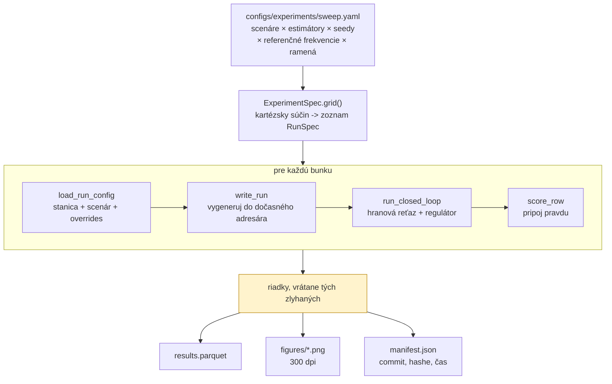
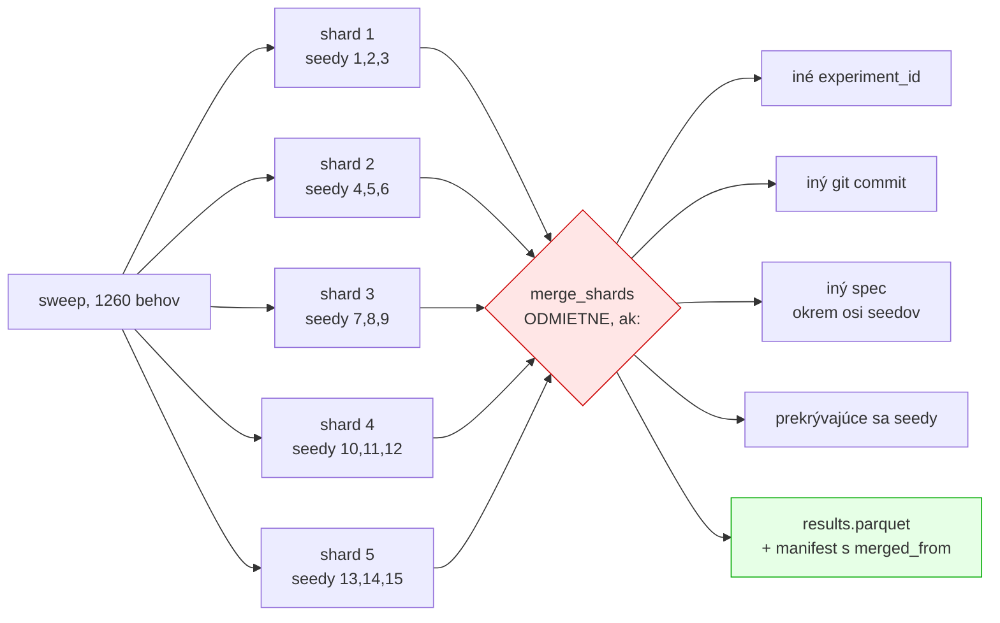
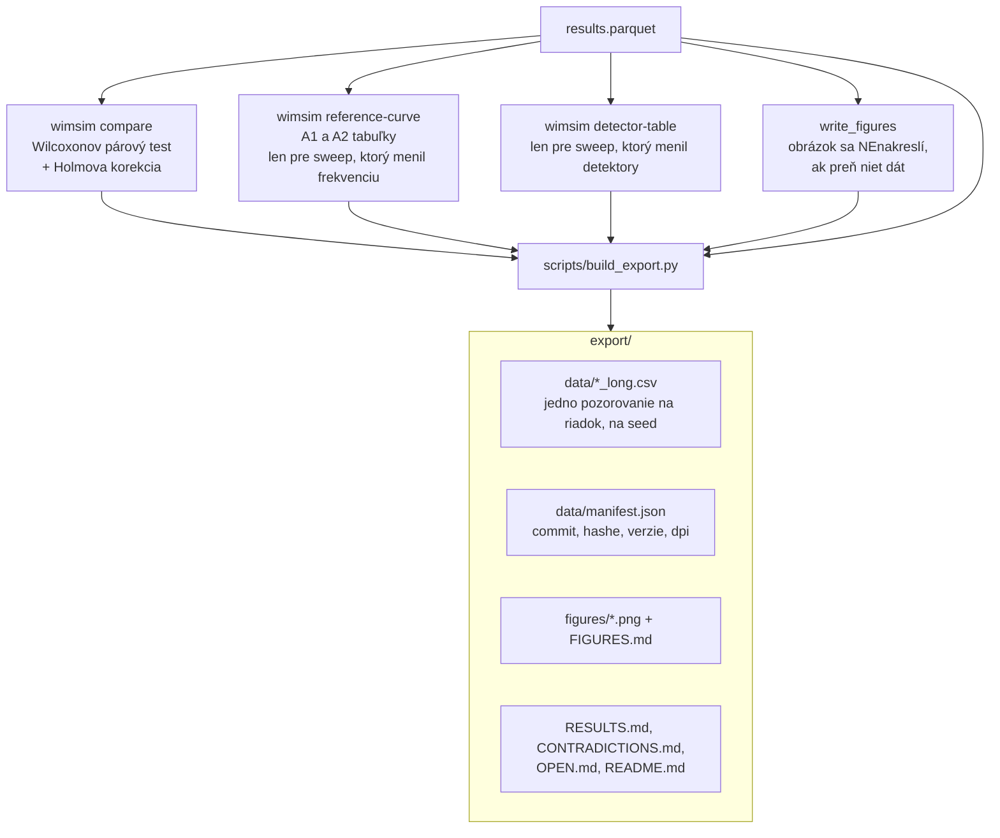

# Ako sa experimenty púšťali a vyhodnocovali

Doplnok k [`simulacia-sk.md`](simulacia-sk.md), ktorý popisuje samotný model. Tento dokument je o
vrstve nad ním: ako sa z jedného behu stane sweep, ako sa sweep rozdelí na stroje, ako sa výsledky
spoja a ako sa z nich stane číslo, ktoré smie ísť do článku.

---

## 1. Čo je „beh“ a čo je „sweep“

**Beh** je jedna bunka mriežky: jeden scenár × jeden estimátor × jeden seed × jedna referenčná
frekvencia × jedno rameno regulátora. Vyprodukuje **jeden riadok** s 48 stĺpcami.

**Sweep** je deklaratívna mriežka v `configs/experiments/*.yaml`. Beží cez
`wimsim experiment <meno>` a zapíše `results.parquet`, `results.md`, `results.tex`,
`manifest.json` a adresár `figures/`.



**Bunka, ktorá zlyhá, sa stane riadkom, ktorý to hovorí** — nezhodí sweep a ani ticho nezmizne.
Zahodiť ju by zmenilo, nad čím je každý priemer v tabuľke priemerom.

---

## 2. Rozdelenie na shardy a spätné spojenie

Sweep s 2 520 behmi trvá na tomto stroji desiatky hodín ako jeden proces. Jediná os, ktorá sa delí
**presne**, je os seedov: ten istý seed dá bajt po bajte rovnaký prúd vzoriek bez ohľadu na to, kde
beží, takže shardy sa zreťazia do presne toho, čo by vyprodukoval jeden proces.



Kontrola prekrytia seedov je dôležitejšia, než vyzerá: **determinizmus robí duplikovaný beh
identickým**, a práve to spôsobuje, že by dvojité započítanie bolo neviditeľné. Žiadny medián by
nevyzeral podozrivo; iba by bol vážený smerom k zdvojenému seedu.

Výnimka pri kontrole špecifikácie je os seedov — `--seeds 1,2,3` a `--seeds 4,5,6` zapíšu odlišné
`spec.seeds`, a kontrola, ktorá by to nevyňala, by odmietla každý skutočný shard. Presne tak táto
kontrola aj zlyhala, keď prvýkrát stretla tri shardy, pre ktoré bola napísaná.

---

## 3. Od riadkov k tvrdeniu



### 3.1 Prečo párový test a nie t-test

Behy sú **párované podľa seedu**. Ten istý seed dá bajt po bajte identický prúd vzoriek, takže
rameno so zapnutým a vypnutým regulátorom sa líši presne v jednej veci. To je presne nastavenie,
pre ktoré je znamienkovo-poradový test stavaný.

Wilcoxon a nie t-test, lebo nič tu nie je známe ako normálne a viaceré rozdelenia viditeľne nie sú.
Holm a nie Bonferroni, lebo Holm je rovnomerne silnejší pri rovnakej rodinnej chybovosti.

**Rodinu deklaruje volajúci, explicitne.** Korigovať cez „všetky testy, ktoré som spustil“ a cez
„sedem scenárov v tejto tabuľke“ sú rôzne tvrdenia, a ktoré z nich sa robí, musí byť rozhodnutie,
nie náhoda.

### 3.2 Čo počet seedov vôbec dovoľuje

Najmenšie dosiahnuteľné obojstranné *p* je `2 / 2ⁿ`:

| seedy | podlaha *p* | čo z toho plynie |
|---:|---:|---|
| 3 | 0,25 | **nič nemôže dosiahnuť 0,05**, nech je efekt akokoľvek veľký. Tieto sweepy sú popisné a sú tak aj označené |
| 10 | 0,00195 | prejde cez korekciu v malej rodine |
| 15 | 6,1·10⁻⁵ | prejde cez 42-testovú rodinu |
| 30 | < 10⁻⁸ | pohodlne |

Toto nie je formalita. V tomto projekte sa už stalo, že trojseedový výsledok bol skreslený **a v
jednej bunke mal opačné znamienko**: `cintron_ladder` pri troch seedoch hlásil −13,66 kg tam, kde
tridsať seedov hlási +9,60 kg a signifikantne horšie. A pri poslednom sweepe trojseedová detekčná
recall 0,000 pri jednej referencii na dvadsať vyšla pri pätnástich seedoch ako 0,200 — tie nuly
boli **výberové**, nie štrukturálne.

Pravidlo, ktoré z toho platí: **ak silnejší beh protirečí slabšiemu, tá protirečivosť je ten
nález.**

### 3.3 Odmietnuť radšej než spriemerovať

Viaceré redukcie radšej vyhodia výnimku, než by vrátili číslo, ktoré vyzerá použiteľne:

- `compare` **odmietne** párovanie, ak je voľná os, ktorú párovanie nezohľadňuje — inak by sa
  rozdiel bral voči ľubovoľnému z dvoch riadkov.
- `reference-curve` **odmietne** sweep, ktorý bežal na jednej referenčnej frekvencii: obe
  relácie, ktoré hlási, sú tvary voči tej frekvencii, a jednobodová krivka by sa čítala ako trend.
- `detector-table` **odmietne** sweep s jedným ramenom detektora, lebo spriemerovaný cez scenár by
  sa z piatich ramien stal jeden riadok opisujúci ensemble pod hlavičkou tvrdiacou, že ich
  porovnáva.
- Recall na scenári bez vloženej poruchy je **nedefinovaný, nie nulový**. Detektor nemôže minúť
  niečo, čo tam nikdy nebolo, a tabuľka, ktorá do tej bunky napíše 0,000, hovorí opak toho, čo sa
  stalo.

---

## 4. Čo sa reálne spustilo

Export stojí na **14 sweepoch a 4 454 behoch**, čo je 138 074 pozorovaní v dlhom formáte.

| sweep | behy | seedy | na čo |
|---|---:|---:|---|
| `ladder` | 63 | 3 | každý estimátor cez každý skórovateľný scenár |
| `ladder30` | 630 | 30 | to isté pri tridsiatich seedoch — prvé testy signifikancie |
| `cintron_ladder` | 63 | 3 | tie isté scenáre na fyzike **reálneho** prístroja |
| `cintron_ladder30` | 630 | 30 | to isté pri tridsiatich seedoch |
| `reference_rate` | 180 | 3 | referenčná frekvencia × rameno regulátora, Page-Hinkley 15,0 |
| `reference_rate_ph75` | 180 | 3 | to isté pri opravenom prahu 7,5 |
| `reference_rate30` | 1 260 | 15 | sedem frekvencií vrátane „každé vozidlo“, pri sile |
| `heldout30` | 360 | 30 | **štyri scenáre, na ktorých sa nič neladilo** |
| `ablation` | 150 | 10 | S6 s každou triedou poruchy postupne odstránenou |
| `governance` | 18 | 3 | slučka zapnutá/vypnutá na S6 |
| `detectors` | 100 | 10 | štyri detektory samostatne plus ensemble |
| `detector_thresholds` | 340 | 10 | 17 prahových ramien — zvyšok krivky recall/falošné poplachy |
| `recal_coverage` | 300 | 10 | frekvencia rekalibrácie proti pokrytiu intervalu |
| `theta2` | 180 | 30 | trojparametrická mapa proti dvojparametrickej |

Mimo sweepov: `wimsim validate-sim` — krížová validácia parametrov simulátora metódou „vynechaj
jeden záznam“ nad ôsmimi reálnymi nahrávkami.

---

## 5. Prahy Page-Hinkleyho, čiže prečo sa sweepy nedajú miešať

Odoslaná predvoľba bola **15,0** pre každý sweep okrem troch, a po `detector_thresholds` sa
presunula na **7,5**. Nič sa spätne nepreháňalo: **tá prahová krivka je sama výsledok**, a
prebehnúť všetko v jednom opravenom bode by zakrylo, ako sa našiel.

Dôsledok, ktorý treba povedať nahlas: konfigurácie starších sweepov stále hovoria
`edge_config: default`, a tá predvoľba sa dnes rozvinie na 7,5. **Ich spustenie dnes nezreprodukuje
uložené čísla.** Nesúlad je detegovateľný, nie tichý — každý riadok nesie `edge_config_hash` a ten
sa bude líšiť.

Preto novšie konfigurácie prah **pripínajú explicitne**: súbor, ktorý si zapíše vlastný pracovný
bod, znamená o rok to isté, čo znamená dnes.

---

## 6. Výpočtová realita tohto stroja

Merané, nie odhadované: stroj udrží približne **2,8 behu za minútu bez ohľadu na počet shardov**
(10 shardov dalo 2,6; 5 shardov 2,79; jeden proces 1,7). Paralelizmus teda prináša iba 1,6× a
záťaž je viazaná šírkou pásma pamäte, nie procesorom — pri desiatich procesoch bolo vyťaženie
7,5 jadra z dvanástich logických a disk nečinný. Cena behu je plochá voči referenčnej frekvencii,
čiže ju určuje **generovanie signálu**, nie kalibračná práca.

Po optimalizácii sledovača nulovej čiary (1,58×) je priepustnosť približne 4,4 behu za minútu.
Posledný sweep trval 28,3 hodiny na 1 260 behov.

---

## 7. Reprodukcia

```bash
# jeden sweep, jeden proces
wimsim experiment ladder30 --out data/results/ladder30

# ten istý sweep po shardoch, keď sa ponáhľa
wimsim experiment reference_rate30 --seeds 1,2,3   --out data/results/reference_rate30_s1
wimsim experiment reference_rate30 --seeds 4,5,6   --out data/results/reference_rate30_s2
# ...a potom spojiť cez wimsim.experiments.merge.merge_shards

# čo sa spustí, bez toho, aby sa čokoľvek spustilo
wimsim experiment reference_rate30 --dry-run

# analýzy nad hotovým sweepom
wimsim compare          data/results/reference_rate30
wimsim reference-curve  data/results/reference_rate30
wimsim detector-table   data/results/detector_thresholds

# krížová validácia simulátora proti reálnym nahrávkam
wimsim validate-sim data/real --channel Tenzo2 --out data/results/sim_crossval

# prestavba celého exportu
python scripts/build_export.py
```

Overenie determinizmu — vygeneruj ten istý beh dvakrát a porovnaj hashe súborov:

```bash
wimsim generate S1_nominal --out /tmp/a --seed 1
wimsim generate S1_nominal --out /tmp/b --seed 1
wimsim verify-determinism /tmp/a /tmp/b
```

Porovnáva `samples.parquet`, `truth_passes.parquet` a `truth_timeseries.parquet` po bajtoch, plus
`config_hash` a `output_hash` z oboch manifestov.
