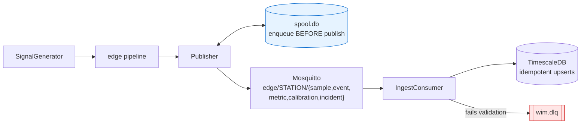
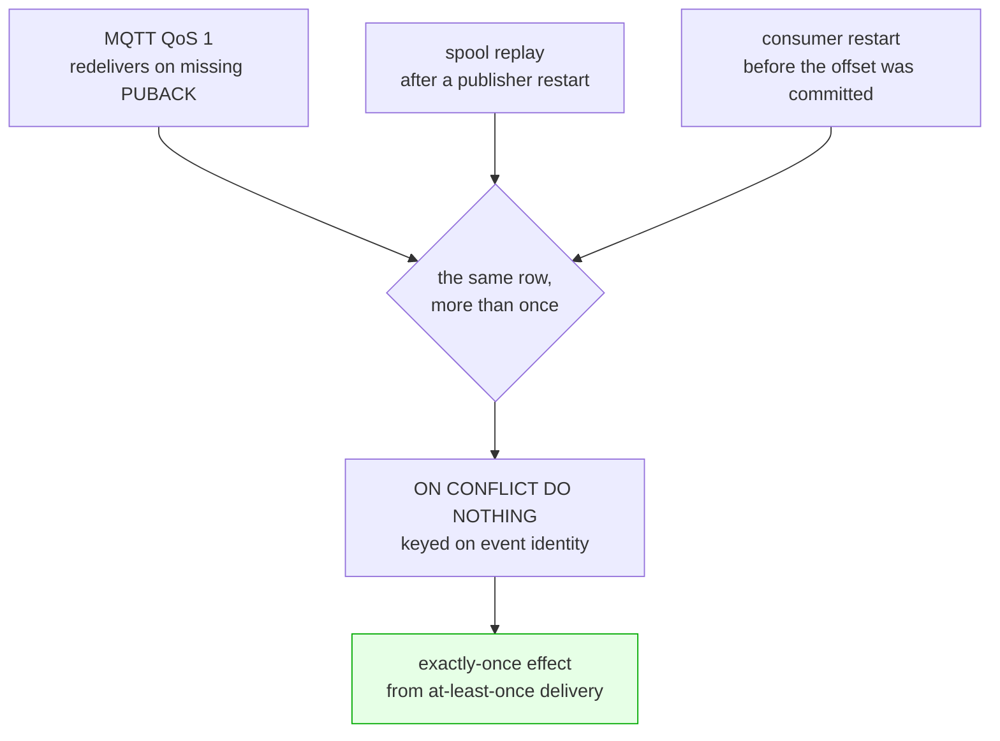

# The phase-3 stack

What each service is for, how an event travels from the generator to a dashboard, and the failure
modes the transport and ingest layers are built around.

```bash
docker compose --profile full up -d     # everything
docker compose --profile core up -d     # just Mosquitto and TimescaleDB
alembic upgrade head                    # create or update the schema
make up / make up-core / make migrate / make down / make logs
```

| service | host port | what it is for |
|---|---|---|
| Mosquitto | 1883 | the only thing the station talks to |
| TimescaleDB | **5433** | events, calibration state, metrics, incidents, truth |
| OTel Collector | 4317 / 4318 | where the station pushes traces, metrics and logs |
| Prometheus | 9090 | scrapes the collector, not the station |
| Loki | 3100 | structured logs |
| Tempo | 3200 | traces |
| Grafana | 3000 | the UI (buildspec section 13: there is no other one) |

**TimescaleDB is on 5433, not 5432.** A local PostgreSQL on 5432 is the common case, and silently
connecting to the *wrong* database is far worse than a refused connection. Override with `PGPORT`
in `.env`.

Image tags are pinned. An artifact whose infrastructure drifts under it cannot be reproduced months
later, and "it worked in March" is not a result.

---

## The path an event takes



Each arrow is a place data can be lost, and each one has a guard. The two coloured nodes are the
guards that cost something: the spool makes the publisher durable across a restart, and the dead
letter queue means nothing unvalidated reaches the database **and** nothing is silently discarded —
the two failure modes that look identical from a dashboard.

The topic map is many-to-one on purpose: all three `calibration.*` payloads share one MQTT topic,
because a subscriber wants the calibration stream rather than three subscriptions it has to
reassemble in order. An unknown schema topic raises rather than inventing a topic that would
deliver to nobody and look, from the publisher's side, exactly like success.

### Publisher: nothing is acknowledged until the broker confirms it

Enqueue happens **before** publish, acknowledgement **after**. Anything else leaves a window in
which an event exists only in memory.

* **The spool is on disk.** A station is a box on a roadside. An in-process buffer survives a broker
  outage and does not survive the station rebooting, and the second failure is the one that loses a
  day of data. SQLite in WAL mode: one fsync per batch, atomic acknowledgement, and a depth query
  that is not `ls` over half a million files.
* **Delivery means PUBACK, not return.** `paho.publish()` returning success only means the packet
  was queued in the client. Treating that as delivered would let the spool forget messages the
  broker never saw -- precisely what the spool exists to prevent.
* **Replay is in timestamp order.** Not insertion order, not arrival order. An estimator that
  updates on arrival time rather than measurement time steps the wrong way when a backlog drains,
  which is what `S5_outage` exists to expose; delivering out of order would make that the
  pipeline's fault rather than the estimator's.
* **`publish()` never blocks on the network.** The pipeline calling it is processing a sample stream
  in real time, and making it wait on a socket would turn a network problem into dropped samples --
  strictly worse than a growing backlog.
* **The queue is bounded and drops oldest-first, counting what it dropped.** Unbounded buffering
  turns a link outage into a full disk, which takes the station down completely. Dropping is bad;
  dropping silently is worse.

The backoff gate rate-limits automatic retries so a publisher in a loop cannot hammer a dead broker.
Two things bypass it, because in both the caller knows something the timer does not: an explicit
`force` (a reconnect handler, a shutdown flush), and the transport reporting a fresh connection --
a link that has just come back is the one moment when honouring a 30 s backoff is exactly wrong.

The MQTT last will is a retained `system.incident` on the station's own topic, so a station that
dies without saying goodbye announces it itself rather than being noticed later by a heartbeat rule
somebody has to remember to write.

### Ingest: nothing unvalidated reaches the database, nothing is silently discarded

A pipeline that quietly drops what it cannot parse is indistinguishable, from the outside, from one
that is working.

Reason codes are fixed strings, not free text, so a dashboard can group by them. That is the
difference between "the DLQ is filling up" and "the DLQ is filling up with `invalid_json` from one
station since 14:20".

| reason | meaning |
|---|---|
| `invalid_utf8` | the payload is not text |
| `invalid_json` | it is text but not JSON |
| `not_an_object` | valid JSON, but an array or a scalar |
| `missing_topic` | an object with no `topic` field |
| `unknown_topic` | a `topic` no model claims |
| `topic_mismatch` | the payload's type disagrees with the MQTT topic it arrived on |
| `schema_validation_failed` | the right shape, wrong contents -- detail names the field |

**The MQTT topic is a hint, not the answer.** A producer can publish anything anywhere; the
payload's own `topic` decides which model validates it, and a disagreement is itself a defect rather
than something to resolve by preferring one side.

**A valid payload of a type nothing persists yet is counted, not dead-lettered.**
`calibration.drift_detected` arrives in phase 5; it is not malformed, there is simply nowhere to put
it. Dead-lettering valid data would make the DLQ meaningless.

**A failed flush puts its rows back.** A database that is briefly unavailable must not undo the
guarantee the station's spool just provided.

### Storage: idempotent, because delivery is at-least-once three separate ways

QoS 1 permits redelivery, a drained backlog can resend, and phase 5's `recompute --from <ts>
--profile <id>` re-derives history deliberately. All three must converge on one row per event, so
every event write is an upsert keyed on `(event_id, ts_start)`.

Re-running a recompute under a new profile **updates the row in place** rather than leaving two
opinions in the table.

Samples, metrics and incidents are inserted rather than upserted: they have no identity to
deduplicate on, and that is the right trade for streams whose value is aggregate. Events, which a
paper cites one at a time, get a key.

---

## Schema

Twelve tables in two schemas, seven hypertables, two continuous aggregates.

Delivery is at-least-once in three independent places, so every write is idempotent:



**Alembic owns the schema.** The compose init script creates extensions and schemas only. An init
script that creates tables works exactly once -- on a fresh volume -- and then diverges from the
code for the rest of the project's life.

**`truth.*` is separate** (buildspec section 8) and is joined only by the scoring layer. In replay
mode it is empty, so any dashboard panel overlaying true gain goes blank. That is correct: a real
recording has no true gain, and a panel that invented one would be lying.

**Hypertable partition keys must appear in every primary key.** That constrains
`measurement_event`: its natural key is `event_id` alone, but the primary key must include
`ts_start`. Safe rather than a compromise -- `event_id` is a UUIDv5 *of* `ts_start` -- but worth
knowing before someone tries to "fix" it.

Continuous aggregates exist for dashboard performance: `event_rate_1m` and `calibration_1m`. A panel
showing a week of throughput must not scan a week of raw events every time it is opened. Refresh one
by hand after a bulk backfill with `EventWriter.refresh_aggregate`, which handles the two things
TimescaleDB is fussy about: it cannot run inside a transaction, and its NULL arguments need explicit
casts.

`sensor_sample` has a seven-day retention policy by default -- at 2 kHz one station produces 170
million rows a day. Events, which are what a paper cites, are kept forever.

---

## Observability wiring

**The edge is not scraped; it pushes.** A station behind a link that goes down is exactly what `S5`
simulates, and a pull-based scrape cannot survive it. Everything goes to the OTel collector over
OTLP, and Prometheus scrapes the collector.

Two configuration details that are not obvious and cost an afternoon each:

* **Grafana provisioning interpolates `$VAR` but not `${VAR:-default}`.** The bash-style form
  provisioned the TimescaleDB datasource with an empty user, and it failed only at query time with
  "no PostgreSQL user name specified". Compose now resolves the defaults before Grafana sees them.
* **Loki rejects samples older than a week by default.** A replayed recording carries timestamps
  from when it was recorded, so every one of its log lines would be silently dropped. Disabled.

Dashboards are provisioned **read-only** from `dashboards/`. One edited in a browser and never
committed is a result nobody else can reproduce.

---

## Testing without Docker

Unit tests use an `InMemoryTransport` that can be switched off, made to fail after N messages, or
made to fail intermittently -- deterministically and in microseconds. Every property worth checking
about the publisher is about what happens when delivery *fails*, and a real broker is very bad at
failing on demand.

Integration and end-to-end tests then check what a fake cannot, and **skip with instructions** when
the stack is down. That is a deliberate trade: a skipped test is a test nobody runs, so CI is
expected to bring the stack up.

```bash
pytest                                   # everything; stack tests skip if it is down
docker compose --profile core up -d && alembic upgrade head && pytest    # everything, for real
```

---

## Phase 3 checkpoint

> *Checkpoint: synthetic passes visible in Grafana end to end.*

Met. A 900 s `S1_nominal` run: 47 passes generated, 47 events detected and estimated, 47 published,
47 stored, 0 dead-lettered, 15 one-minute aggregate buckets, and every panel on the
**WiM / Station operations** dashboard returning data through Grafana's own query API.

The provenance panel is the one worth looking at: it lists every distinct combination of config
hash, seed, estimator profile and code commit that contributed to the window, and colours a dirty
working tree red with the label "not citable". More than one row means the window mixes runs, and
any aggregate over it is a mixture.

## What phase 3 does not include

Tracing spans across the pipeline, the full metric set, the truth exporter and the remaining four
dashboards are **phase 4**. The stack is wired for all of them -- Tempo and Loki are up, the
collector is receiving, Prometheus is scraping -- but the edge does not yet emit spans or metrics.
