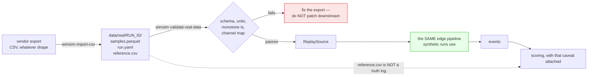

# Real-data input schema

**Fixed before the data exists, on purpose.**

A schema negotiated after recordings arrive is a schema shaped by whatever the logger happened to
emit. A schema fixed beforehand is a specification the recording either meets or does not. This
document is the second kind. It is what `wimsim validate-real-data` enforces, and
`src/wimsim/source/real_schema.py` is the executable version of it.

The point of principle 2 is that switching from synthetic to real data is a config change and
nothing else. `configs/scenarios/S8_replay_real.yaml` already exists and is already valid — it is
the whole change.

---

## Layout

```
data/real/<run_id>/
├── samples.parquet     the sample stream
├── run.yaml            what the station was
└── reference.csv       what the vehicles actually weighed
```

One directory per drive. `<run_id>` is free-form but should be stable and meaningful
(`drive_01`, `2026-03-14_lane1`) because it appears in provenance.



The green node is principle 2 made concrete: a replayed recording enters the identical pipeline, so
switching to real data is a configuration change and nothing else. The dotted edge is the caveat
that governs everything the real corpus can support — `reference.csv` carries masses that were
*inferred*, not weighed, and a scoring run against it measures whether the pipeline reproduces that
inference rather than whether it weighs vehicles.

---

## `samples.parquet`

| column | type | required | notes |
|---|---|---|---|
| `ts` | `int64` | yes | UTC **microseconds since the Unix epoch** |
| `channel_id` | `string` | yes | must appear in `run.yaml: channel_map` |
| `raw_value` | `int64` or `float64` | yes | ADC counts or mV/V — declare which in `raw_value_kind` |
| `temperature_c` | `float64` | no | co-located probe reading, degC |

### Why `ts` is an integer, in microseconds, in UTC

Three separate mistakes are being ruled out, and each has cost real projects their event alignment:

* **Not a float.** A float64 holding seconds-since-epoch has ~200 ns resolution at present-day
  timestamps and, worse, loses *exact* ordering: two samples 500 µs apart can round to the same
  value. Integer microseconds are exact for any rate this project will ever see.
* **Not a local-time string.** Local time is ambiguous twice a year. A recording that straddles a DST
  boundary with local timestamps is unrecoverable, and field recordings run overnight.
* **Not "seconds since start".** Correlating a recording with an external reference weighing, or with
  another channel, requires absolute time. Relative time can always be derived; absolute time
  cannot be recovered.

If the logger emits something else, convert it *once*, at export, and keep the original. Do not ask
the pipeline to accept several conventions — that is how a unit error becomes a published number.

### Rows may be interleaved across channels

Multi-channel recordings normally interleave. That is fine: the validator checks monotonicity
*per channel*, and `ReplaySource` selects one channel and sorts it. Rows out of timestamp order
within a channel produce a warning, not a rejection, because a stable sort fixes it.

---

## `run.yaml`

```yaml
station_id: ST-FIELD-01          # required
sample_rate_hz: 2000.0           # required
raw_value_kind: counts           # required: 'counts' or 'mv_per_v'
adc_bits: 16                     # required
adc_range: [-0.5, 3.0]           # required: [min, max] in the unit implied by raw_value_kind
channel_map:                     # required
  CH0: {sensor_id: S1, lane: 1, role: primary}
  CH1: {sensor_id: S2, lane: 1, role: redundant}

excitation_v: 5.0                # optional but strongly wanted
gauge_factor: 2.05               # optional but strongly wanted
start_time: 2026-03-14T05:12:00Z # optional, informational only; ts is authoritative
notes: |                         # optional
  Lane 1, southbound. Sensor grouted 2025-11. Reference weighings on the
  static scale 300 m downstream, same day.
```

`raw_value_kind` is required and has no default. Guessing whether a column is counts or millivolts
from its dtype is exactly the kind of inference that produces a silent factor-of-65536 error, so the
recording must say.

`excitation_v` and `gauge_factor` are optional to the validator but are what make the recording
physically interpretable rather than merely replayable. Include them if they are known; write
`null` and a note if they are not.

---

## `reference.csv`

| column | required | notes |
|---|---|---|
| `pass_id` | yes | unique within the run |
| `reference_mass_kg` | yes | static mass, from a weighbridge or a known load |
| `t_approx` | yes | ISO 8601 UTC or epoch microseconds — approximate crossing time |
| `axle_reference_kg` | no | semicolon-separated per-axle static loads |
| `vehicle_description` | no | free text |
| `speed_kmh` | no | independent speed measurement, if any |

`t_approx` may be approximate — that is the point of the name. Matching a reference weighing to a
detected event is a windowed join in the scoring layer, not an exact key lookup; a few seconds of
error is expected and handled.

### `reference.csv` is not a truth log

This distinction is load-bearing and easy to lose.

The synthetic truth log is dense, exact, and knows the plant state at every instant. A reference
weighing is **sparse**, carries **its own uncertainty** (a static scale is not perfect, and the
vehicle may have changed load between the two measurements), and describes only the vehicle, never
the sensor.

Consequences that follow from that, and are honoured in the code:

* `ReplaySource` never reads it. It is consumed by the scoring layer and, in `supervised` mode, by
  the estimator as a *measurement update* — not as an oracle.
* Dashboards that overlay true gain against estimated gain **degrade to empty** in replay mode.
  That is the correct behaviour: there is no true gain to draw. A dashboard that invented one would
  be lying.
* Accuracy figures from replay runs are accuracy *relative to a reference weighing*, with its own
  error bar, and must be reported that way.

A run with no `reference.csv` is still useful — it can be replayed, its noise and drift can be
characterised, and it feeds the sim-to-real gap report. It just cannot be scored. The validator
warns rather than fails.

---

## Checking a recording

```bash
wimsim validate-real-data data/real/drive_01
```

The validator reports the four things that actually go wrong with field recordings, in the order
they hurt:

| # | problem | severity | why it matters |
|---|---|---|---|
| 1 | timestamp gaps | warning | dropped blocks silently shorten integration windows, so an area feature computed across a gap is simply wrong |
| 2 | clock jumps — non-monotonic or backwards time | **error** | usually an NTP step mid-recording; ordering is unrecoverable and every windowed operation downstream is invalid |
| 3 | saturation — samples pinned at a rail | warning | the peak in that window is unrecoverable; the pass must be excluded, not estimated |
| 4 | dropouts — long runs of identical values | warning | a channel that stopped reporting looks like a very quiet road |

It also checks that the median sample interval agrees with the declared `sample_rate_hz` (an error
if it disagrees by more than 2 %), and that every `channel_id` appears in `channel_map`.

**It reports; it never repairs.** A recording that fails is a fact about the recording, and deciding
what to do about it is not the validator's business. `ReplaySource` refuses a failing run by default;
`strict=False` is available and requires you to have read the report.

---

## Replaying

```yaml
# configs/scenarios/S8_replay_real.yaml
source:
  kind: replay
  replay:
    run_dir: drive_01
    rate: accelerated      # or 'true', optionally with speed_multiplier
```

`ReplaySource` performs exactly two conversions, and nowhere else in the system performs them:

* **counts to sensor units**, using the ADC range and bit depth the recording declares;
* **channel selection**, defaulting to the single channel if there is only one.

Everything after that is byte-for-byte the same code path as synthetic generation, which is checked
by `tests/test_source.py::test_a_consumer_cannot_tell_them_apart` — the same consumer function run
over both sources, required to work unchanged.

The test suite writes a synthetic run out in this format and reads it back, so the entire real-data
path — schema, validator, unit conversion, block framing — is exercised before any real recording
exists. When the drives arrive, the only new variable is the data.

---

## Checklist for whoever exports the recordings

- [ ] `ts` is int64, UTC microseconds since epoch, strictly increasing within each channel
- [ ] `raw_value_kind` states `counts` or `mv_per_v`, and the column matches it
- [ ] `adc_bits` and `adc_range` describe the converter that produced `raw_value`
- [ ] every `channel_id` in the data appears in `channel_map`
- [ ] `sample_rate_hz` matches the actual median interval
- [ ] `reference.csv` present if the run is to be scored, with static masses and approximate times
- [ ] `notes` records anything unusual: weather, roadworks, a sensor re-grouted last week
- [ ] `wimsim validate-real-data` reports no errors, and every warning is understood
