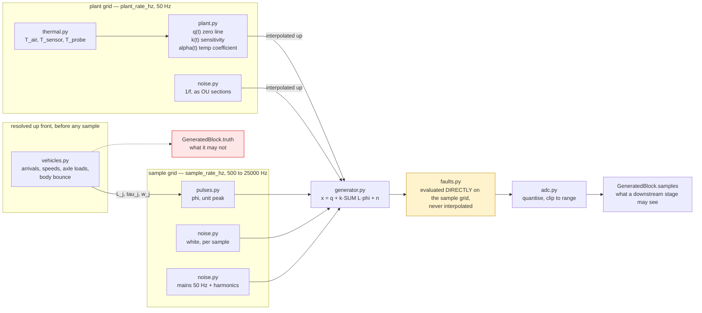
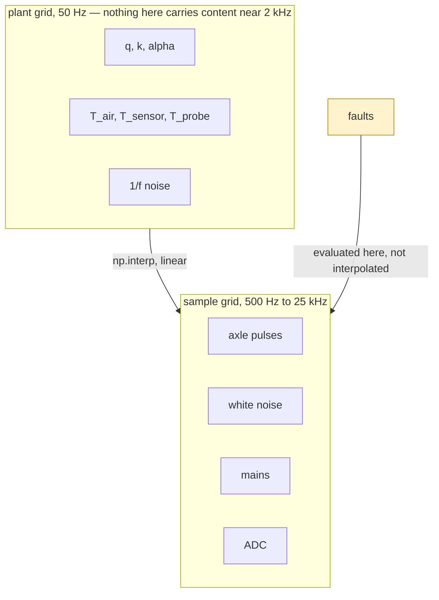

# The generative signal model

The buildspec asks for this document because "the paper's validity rests on the simulator being a
defensible model rather than plausible-looking noise". So every term below comes with the physical
argument for its form, the units it carries, and — where it matters — the test that pins it.

Anything here that turns out to be indefensible is a finding, not an embarrassment. The point of
writing the model down is that it can be attacked.

---

## 1. The equation

```
x(t)      = q(t) + k(t) * SUM_j L_j(t) * phi(t - tau_j ; w_j)  +  n(t)
x_adc(t)  = quantize(x(t), adc_bits, adc_range)
```

Every module in `wimsim.signal` fills in one term of that equation, and the arrows below are the
only couplings between them:



Faults sit between the mixer and the ADC and are evaluated on the fine grid on purpose: interpolated
from the plant grid, a step fault would arrive as a ramp one plant interval wide, and the detector
that is supposed to find steps would be looking at something else.

| symbol | meaning | unit | where |
|---|---|---|---|
| `x` | analog signal at the ADC input | sensor units (default mV/V) | `signal/generator.py` |
| `q(t)` | zero line | sensor units | `signal/plant.py` |
| `k(t)` | sensitivity | sensor units / kg | `signal/plant.py` |
| `L_j` | load applied by axle *j* | kg | `signal/vehicles.py` |
| `phi` | axle pulse shape, unit peak | dimensionless | `signal/pulses.py` |
| `w_j` | pulse width (FWHM) | s | `signal/pulses.py` |
| `tau_j` | time axle *j* crosses the sensor | s | `signal/vehicles.py` |
| `n(t)` | additive noise | sensor units | `signal/noise.py` |

### Sensor units

The signal is modelled in **mV/V**, the natural output of a strain-gauge bridge before
amplification. `k0 = 2.0e-4 mV/V per kg` means a 10 t axle produces 2.0 mV/V — bridge full scale for
an element sized for heavy-goods traffic. Nothing in the code depends on this choice: the simulator
requires only that `sensor.k0`, the ADC range, the drift terms and the noise terms all speak the
same unit, whatever it is called in `adc.unit`.

### Two grids

Generation runs on two time grids, and the split is what makes multi-day runs affordable.



A 48-hour scenario is 8.6 million plant steps and, at 500 Hz, 86 million samples. Integrating the
slow states on the fast grid would multiply the cost of the run by the ratio of the two rates and
change no result, because none of those states has energy anywhere near the sample rate.

| grid | rate | carries |
|---|---|---|
| plant | `scenario.plant_rate_hz`, default 50 Hz | `q`, `k`, `alpha`, all three temperatures, 1/f noise |
| sample | `station.sample_rate_hz` | axle pulses, white noise, mains hum, the ADC |

Plant quantities are linearly interpolated onto the sample grid. This is not an approximation of
convenience: none of them carries spectral content anywhere near the acquisition rate — the fastest
is the 1/f component, deliberately band-limited to `pink_f_max_hz` (20 Hz by default), and the
validator refuses a configuration where `plant_rate_hz < 2.5 * pink_f_max_hz`.

**Fault effects are excluded from this interpolation.** They are evaluated directly on the sample
grid, so a step fault is a step and not a ramp one plant interval wide
(`tests/test_generator.py::test_gain_step_fault_lands_exactly_on_the_sample_grid`).

---

## 2. `phi` — the axle pulse, and why it has unit peak

**This is the most consequential modelling decision in the file, so it goes first.**

A strip or bending-plate sensor under a rolling tyre sees a force that is approximately the axle
load, held constant for as long as the contact patch covers the sensor. Treating the sensor as a
line and the patch as a length `c` along the direction of travel:

```
pulse duration   w = c / v           (v = vehicle speed)
pulse peak       ~ L                 (independent of speed)
pulse area       ~ L * c / v         (inversely proportional to speed)
```

So the model normalises every pulse shape to **unit peak**, and the consequence is that

* **peak** is the speed-invariant feature, but sees the full noise bandwidth of a single instant;
* **area** averages the noise down over the whole pulse, but is proportional to `L/v` and therefore
  needs a speed estimate before it means anything.

Which of the two estimates mass better under noise is exactly the question the buildspec refuses to
pre-decide, so both are emitted as features and phase 2 measures it. Do not "fix" the normalisation
to make area speed-invariant; that would hide the trade-off the experiment exists to expose.

Two consequences worth stating out loud:

* Pulse width comes from kinematics, so **speed variation is a controllable experimental factor**
  and not an afterthought.
* Peak-picking on raw samples cannot beat the sample grid. At 2 kHz, a car at 112 km/h with a 0.16 m
  patch gives a 5.1 ms FWHM — about ten samples. The largest *sample* undershoots the true peak by
  up to `1 - exp(-(dt/2)^2 / 2 sigma^2)`, a few tenths of a percent, systematically low and not
  reducible by averaging. `tests/test_generator.py` pins both the bound and the fact that
  three-point parabolic interpolation gets back under 0.1 %. The phase-2 detector inherits this
  constraint.

### The three shapes

**Three of these four model a contact-force sensor; the fourth models a different instrument.**
`gaussian`, `emg` and `ringing` describe a sensor that measures the force under a tyre, so their
width is the footprint divided by speed -- milliseconds. `influence_line` describes a strain gauge on
a structural member, whose width is the member's *influence length* divided by speed, often a
hundred times longer, with the axles of a car overlapped into a single envelope. Which one applies is
a property of the hardware, selected by `pulse.width_source`. See `docs/sim-to-real.md`: the real
station is the second kind.

| shape | form | why |
|---|---|---|
| `gaussian` | `exp(-t^2 / 2 sigma^2)`, `sigma = FWHM / 2 sqrt(2 ln 2)` | The idealisation. Symmetric, no tail. Use for sanity baselines only. |
| `emg` | Gaussian convolved with a one-sided exponential of time constant `tau = emg_tau_ratio * FWHM` | Real pad and pavement sensors show a trailing tail as the structure relaxes behind the axle. Right-skewed, which biases any symmetric-window estimator. |
| `ringing` | Gaussian plus a damped sinusoid `A exp(-zeta w_n t) sin(w_d t)` starting at the impact instant | The axle excites a structural mode. This is the shape that makes naive peak-picking hard, and the only one where the maximum is not at an axle time. |
| `influence_line` | clipped parabola `1 - (t/h)^2`, `h = FWHM/sqrt(2)` | The response of a strain gauge on a structural member. **Chosen by fitting six real crossings, not by eye:** normalised RMS residual 5.2 %, against 6.9 % for a raised cosine, 8.7 % for a Gaussian and 10.2 % for the textbook triangular influence line. The residual is real structure -- overlapping axles, a non-ideal member -- so it is a defensible primitive rather than a claim of exactness. |

Implementation notes that matter:

* The EMG is evaluated as `exp(-u^2/2) * erfcx(z)` rather than the textbook
  `exp(sigma^2/2tau^2 - ...) * erfc(...)`. The two are algebraically identical — the exponential
  prefactor cancels exactly against `exp(-z^2)` — but only this form survives a small `tau` without
  overflowing.
* Peak normalisation for `emg` and `ringing` is found numerically on a fixed dense grid and cached
  on the parameters that determine the shape (for `emg`, the ratio alone: the shape is self-similar
  in units of `sigma`). Fixed grid, so the result is reproducible.
* The ringing term is **causal**: zero for `t < 0`. A structural mode cannot precede the impact that
  excites it, and a test asserts it does not.
* `support_widths` truncates the pulse at ±8 FWHM by default. For `ringing` with light damping this
  clips a small residual tail; raise it if that matters for your experiment.

---

## 3. `L_j` — loads, and the difference between static and applied

Two masses exist and conflating them is the classic WiM error.

* **`axle_static_kg`** — what a weighbridge would report. This is the estimation target and what
  `true_mass_kg` sums.
* **`axle_applied_kg`** — the load actually pressing on the sensor at the instant of crossing.

They differ because the sprung mass oscillates: a vehicle in motion is a mass on springs, and the
instantaneous force under an axle is the static load plus a dynamic component. The model applies

```
L_j = static_j * (1 + A sin(2 pi f (tau_j - tau_0) + varphi))
```

with `A = dynamic_load.amplitude` (default 6 %), `f` drawn per vehicle around 2 Hz (body bounce),
and one random phase `varphi` per vehicle **shared across its axles** — they share a body, so their
dynamic components are coherent, not independent.

This is the irreducible error floor of any WiM installation: no calibration can recover a static
mass from a single crossing of a bouncing vehicle. The truth log records both quantities so the
floor is *measurable* rather than hidden inside the residual, and `dynamic_error_kg` is the column
that makes it visible.

It is the irreducible error **relative to the scalar feature**, and it counts dynamic load only:
sensor noise `n(t)` carried through the feature into the mass is not in it. On `S1_nominal`, where
dynamic load is off, the floor is therefore zero while the error is not, and the gap is an upper
bound on what any estimator could recover. A floor that also counted propagated sensor noise —
the error of an oracle predicting with the true `k(t)` and `q(t)` — would need per-event
predictions, which no run keeps; it has not been computed.

Dynamic load is **off** in `S1_nominal` (the sanity baseline must be clean) and **on** everywhere
else.

### Population

* **Arrivals** — Poisson. Memoryless headways are the standard free-flow model. A minimum headway is
  then enforced by pushing later arrivals back, which is both physically true and necessary for
  pulses to remain separable.
* **Axle loads** — lognormal, parameterised by mean and coefficient of variation. Loads are positive
  and right-skewed; a Gaussian would generate negative axle loads in the tail.
* **Speeds** — *truncated* normal, sampled by inverse CDF. Not a clipped normal: clipping piles
  probability mass onto the limits and would create a population of vehicles all doing exactly
  130 km/h.
* **Classes** — car / van / rigid truck / 5-axle artic, with European-representative spacings and
  loads. The shipped mix gives artics a mean of ~36 t and a 99th percentile of ~45 t, i.e. mostly
  legal with a few overloaded. Edit `configs/scenarios/_base_traffic.yaml` to model a different
  fleet.

The whole population is resolved **before** generation starts, so scheduling cannot depend on how
the sample stream happens to be blocked.

---

## 4. `q(t)` — the zero line

Five independently configurable, independently logged components:

```
q(t) = q0 + W(t) + c*t + SUM_i d_i * H(t - t_i) + beta*(T_sensor(t) - T_ref) + q_fault(t)
```

| term | config | physical reading |
|---|---|---|
| `q0` | `zero_drift.q0` | offset at `t = 0` |
| `W(t)` | `random_walk_sigma_per_sqrt_s` | Brownian wander. Unbounded by construction, which is the interesting part: it never returns to where it started, so a forgetting-factor estimator faces a bias/variance trade-off with no static optimum. |
| `c*t` | `linear_slope_per_hour` | deterministic trend (creep, curing) |
| `d_i H(t - t_i)` | `steps`, `step_rate_per_hour` | mechanical settling: discrete, abrupt, either at named times or Poisson-distributed |
| `beta * dT` | `temp_coupling_per_c` | the zero line also breathes with temperature, *additively* — distinct from the gain's temperature coefficient, and separable only because the two enter the signal differently |

Decomposing rather than lumping is what lets an experiment ask "which drift mechanism does the
estimator actually fail on" instead of "does it drift".

The random walk is integrated on the plant grid, which means it has no spectral content above
`plant_rate_hz / 2` by construction. That is a property of the model, not a bug: real zero drift is
a low-frequency phenomenon, and the high-frequency baseline wander that does exist is modelled as
1/f noise instead.

---

## 5. `k(t)` — sensitivity, and the plant the controller has to track

```
k(t) = k0 * (1 + alpha(t) * (T_sensor(t) - T_ref)) * g_fault(t)
```

`alpha` defaults to -2e-4 /degC (-200 ppm/degC), typical for a steel-bodied gauged element.

**`alpha` itself is a random walk** when `alpha_walk_sigma_per_sqrt_s > 0`, and this is the single
most important choice in the model for justifying a closed loop. With a fixed `alpha`, the plant is
a static nonlinearity in a measured variable, and feed-forward compensation is in principle
sufficient — a reviewer would rightly ask why a controller is needed. Let `alpha` wander and no
fixed coefficient is correct for the whole run, which is the situation self-calibration exists for.

`S2_thermal_cycle` and `S6_combined` set `3e-8 /degC per sqrt(s)`, so `alpha` wanders by roughly
1.6e-5 /degC over 72 h — about 8 % of its nominal value. Small, slow, and fatal to a fixed
coefficient.

---

## 6. Temperature — three of them, and why the lag is the whole point

| quantity | model |
|---|---|
| `T_ambient` | daily sinusoid (`daily_amplitude_c`, peaking at `peak_hour_utc`) + linear trend + Ornstein-Uhlenbeck weather noise with correlation time `noise_tau_s` |
| `T_sensor` | `T_ambient` through a first-order lag of time constant `tau_thermal_s` (default 30 min) |
| `T_probe` | `T_sensor` through a further small lag, plus calibration offset, readout noise and quantisation |

**`T_sensor` is what changes `k`. `T_probe` is the only temperature any estimator may see.** That
gap is deliberate and it is the control-theoretic heart of the plant:

* the lag puts a *phase shift* between the temperature a compensator can measure and the sensitivity
  error it is trying to cancel;
* so instantaneous feed-forward compensation on the probe reading is systematically wrong, and the
  residual traces a **hysteresis loop** against ambient rather than scattering about zero;
* a closed loop that estimates `k` from the data does not have this problem.

`S2_thermal_cycle` exists to produce that hysteresis figure. The weather noise is OU rather than
white so that ambient is *smooth*: real air temperature is correlated over minutes, and a white
driving signal would let a low-pass compensator cheat.

Filters use the exact matched-exponential pole `a = exp(-dt/tau)`, not a forward-Euler
approximation, so the discrete response equals the continuous one at the sample instants regardless
of `dt`. `tests/test_signal_model.py` checks the 63 % point after one time constant, the phase lag
on a daily cycle, and the amplitude reduction that comes with it.

---

## 7. `n(t)` — noise

### White

Drawn per sample. **`white_sigma` is the per-sample standard deviation**, so the implied one-sided
PSD is `white_sigma^2 / (fs/2)` — changing the sample rate changes the noise density a fixed sigma
implies. Say which you mean when quoting a number.

### 1/f (pink)

Built as a **superposition of Ornstein-Uhlenbeck relaxation processes with octave-spaced correlation
times**, each of unit stationary variance, the sum scaled to `pink_sigma`.

This is not curve fitting. Flicker noise in strain gauges, amplifiers and adhesives is
conventionally modelled as an ensemble of relaxation processes with a broad distribution of time
constants, and octave spacing of unit-variance sections gives `S(f) ~ 8/(pi f)` across
`[pink_f_min_hz, pink_f_max_hz]`, flattening outside it. The flattening is the physically correct
behaviour: no real process is 1/f down to DC.

Two implementation properties, both tested:

* Sections are initialised **from their stationary distribution**, not from zero, so there is no
  warm-up transient at the start of a run.
* The per-block draw is a single `(n, M)` C-order array, so concatenating two blocks yields exactly
  the same numbers as one block of the combined length. This is what makes output invariant to
  `block_seconds`.

Measured slope on a Welch periodogram is checked to be within `[-1.35, -0.65]`.

### Mains

Fixed-frequency sinusoid plus configured harmonics, with one random phase per run. Its frequency is
*exactly* constant, which is the point: it is the one interferer a notch filter can remove cleanly,
and phase 2 has to decide whether that is worth doing.

---

## 8. The ADC

Mid-tread uniform quantisation with hard clipping at both rails.

* **Counts are primary.** `raw_value` is derived from `raw_counts`, not the reverse, so the reported
  analog value lands exactly on the quantisation lattice — as it does off real hardware, and as it
  will when real recordings arrive as integer counts.
* **Saturation is reported, not silently clipped.** An overloaded channel is a fault condition the
  pipeline must be able to see and the estimator must be able to refuse.
* Quantisation contributes `lsb/sqrt(12)` of noise; at 16 bits over a 3.5 mV/V range that is
  1.5e-5 mV/V, roughly 0.08 kg — an order of magnitude below the default white noise, so it is not
  the limiting term. Shrink `adc.bits` if you want it to be.

---

## 9. Faults

Faults act at two places, and the distinction is not cosmetic.

**Plant faults** change the physics, and are applied before the axle pulses are scaled, so a pass
during the fault genuinely weighs wrong:

| type | effect |
|---|---|
| `gain_instability` | `k` multiplied by `factor` over an interval; `ramp_s > 0` makes it a ramp rather than a step |
| `sensor_displacement` | permanent step in **both** `k0` and `q` — the signature that distinguishes a physical shift from an electronic one |

**Acquisition faults** change what the device reports without changing the physics, and are applied
after quantisation because that is where they happen:

| type | effect |
|---|---|
| `channel_dropout` | samples replaced (`stuck` / `zero` / `saturate_high` / `nan`) and flagged `valid = False`. A `stuck` dropout holds the value the channel actually had when it failed, even across a block boundary. |
| `clock_skew` | station timestamps offset and drifted. The truth log keeps true time and records `clock_offset_s`, so skew is discoverable from the data rather than from the config. |

Every fault produces a **labelled interval in the truth log**. That is what makes drift-detector
evaluation possible at all: false-alarm and missed-detection rates need a reference answer to "was
something actually wrong at time *t*".

Ramped faults deserve a note: a scenario suite that only injects steps flatters CUSUM. `S6_combined`
ramps its gain fault over an hour for exactly that reason.

**Pipeline faults** (`connectivity_loss`, `publish_delay`, `malformed_schema`, `heartbeat_loss`) are
declared in the same config schema but belong to the transport and ingest layers. Phase 1 records
them in the run manifest under `faults_unapplied` and the CLI says so out loud, rather than silently
ignoring configuration.

---

## 10. What this model does *not* claim

Stated plainly, because the honest limitations are the ones a reviewer will find anyway:

* **One sensor, one lane, no vehicle interaction.** Multi-sensor arrays, lane straddling and
  simultaneous passes in adjacent lanes are out of scope.
* **Constant speed across the sensor.** The sensor is centimetres wide; acceleration over that
  distance is negligible. Speed *between* vehicles varies; speed *within* a pass does not.
* **Body bounce is a single sinusoid.** A real vehicle has bounce, pitch and axle-hop modes at
  different frequencies with a suspension transfer function driven by road roughness. One coherent
  mode captures the magnitude and the axle-to-axle correlation, not the spectrum.
* **No pavement dynamics.** The road is not modelled as a structure; the `ringing` pulse shape is a
  lumped stand-in for the structural response, not a modal model of it.
* **Additive, stationary noise.** Real noise amplitude often depends on load and temperature.
* **The generative parameters are representative, not fitted.** They are plausible values for a
  plausible installation, and nothing more, until phase 6's sim-to-real report fits them to the real
  recordings and reports the gap. Until then, absolute error figures from this simulator describe
  the simulator.

None of these invalidates the artifact's purpose, which is to validate architecture and control
behaviour. All of them would invalidate a claim of metrological accuracy, which is why the buildspec
forbids making one and this repository does not make one.
