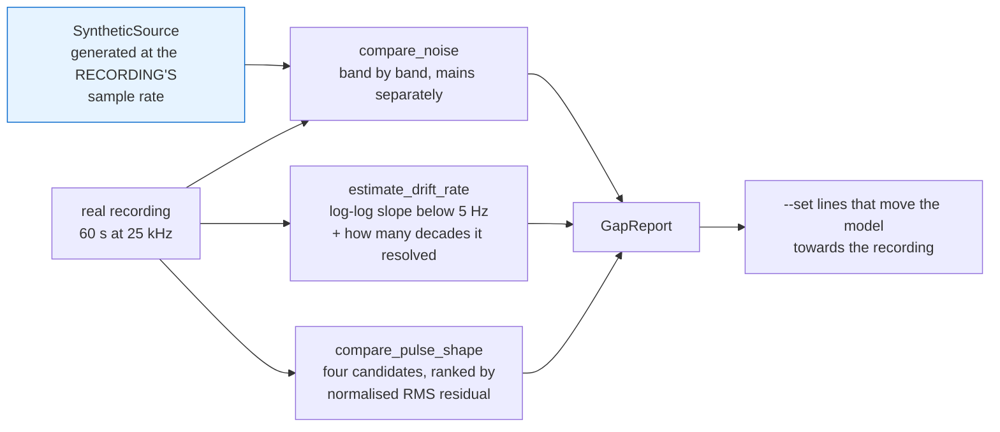
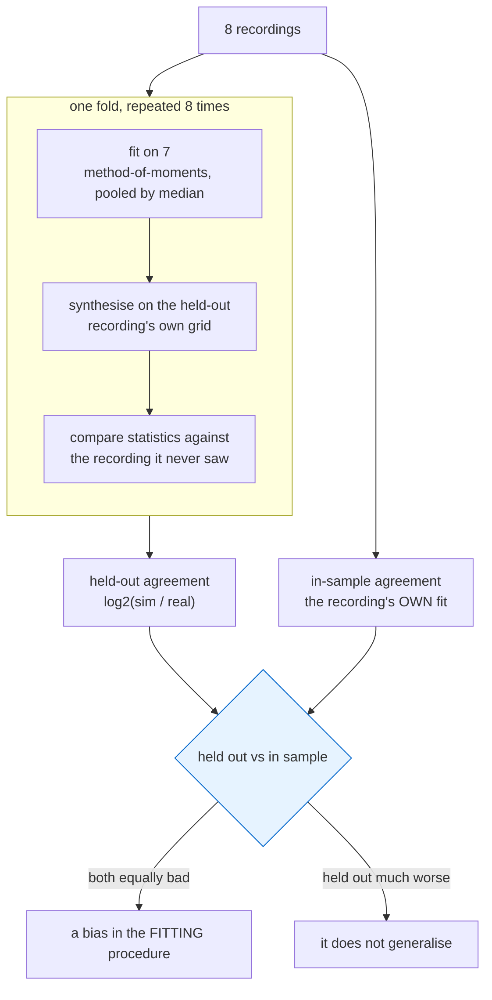

# Sim-to-real: what the real recordings say

Eight recordings from 2026-02-09, plus eleven photographs of the rig. 60.000 s each at 25 kHz, four
channels (`Temp1`, `Temp2` in °C; `Tenzo1`, `Tenzo2` in strain). Five runs with a Citroën
(09:38–09:44), a nine-minute vehicle swap, then three with a Škoda Fabia (09:53–09:56). One file is
named `..._spat` — Slovak for *back* — which turns out to matter.

```bash
for f in WiM-Data/*.csv; do
  wimsim import-csv "$f" --out "data/real/$(basename "$f" .csv)" \
    --station-id ST-CINTRON-1 --gauge-factor 2.0
done
```

1.4 GB of CSV becomes 71 MB of Parquet. The importer, written against one file, handled all eight
without modification.

---

## The headline: this is not the sensor the buildspec assumes

The model — and the buildspec's whole framing — assumes a sensor that **measures contact force under
a tyre**: an axle pulse whose width is the tyre footprint divided by speed, milliseconds long, one
pulse per axle.

The hardware is **two strain gauges on a structural member**. A crossing produces the member's
*influence line*: a single smooth deflection **0.4–1.2 seconds** long in which the two axles of a car
are barely resolved. The photographs show why — a row of paving slabs with an instrumented steel
element set into it, a blue junction box, and a car driven over the line at walking-to-jogging pace.

| | contact-force model (what was built) | structural response (what exists) |
|---|---|---|
| width set by | tyre footprint ÷ speed | influence length ÷ speed |
| typical width | ~5 ms | ~700 ms at test speed |
| axles | one pulse each, resolved | overlapped into one envelope |
| polarity | positive-going | **negative-going** (compressive) |

Neither is wrong; they are different instruments. The simulator now models both —
`pulse.shape: influence_line` with `pulse.width_source: influence_length`, and
`configs/stations/cintron_platform.yaml` — with the contact-force stations left exactly as they were.

---

## What 22 clean crossings establish

Events were extracted from all eight recordings by low-passing at 25 Hz and thresholding the
stronger channel; crossings longer than 2 s were set aside as parked or creeping vehicles.

### 1. Peak amplitude is load-dependent — the prerequisite for weighing

| | Tenzo1 | Tenzo2 |
|---|---|---|
| Citroën (n=16) | −4.50 ± 0.60 µε | −13.06 ± 1.50 µε |
| Fabia (n=6) | −3.20 ± 0.54 µε | −9.07 ± 1.68 µε |
| ratio | **1.405** | **1.440** |
| Welch *p* | 6.2 × 10⁻⁴ | 8.6 × 10⁻⁴ |

The two channels agree on the ratio to within 3 % despite differing by a factor of three in
sensitivity. The sensor measures load.

### 2. Peak amplitude is speed-independent — which validates the peak feature

Correlation between peak amplitude and the speed proxy: **+0.13** (Citroën), **−0.31** (Fabia), both
weak. The response is quasi-static in this speed range, so the peak is a load measurement and not a
rate measurement. That is exactly the property phase 2 concluded made `peak` the better feature, now
confirmed on the real instrument for a different reason.

### 3. Speed is **not** observable here — a phase-3 conclusion, withdrawn

> **This section replaces a claim that was wrong.** Phase 3 reported that the two gauges are
> separated along the direction of travel and that the interval between their peaks is a direct
> speed measurement. The station's owner has since supplied the geometry — **the two gauges are
> 126 mm apart, one parallel to the road and one rotated 90°, and both respond to the whole
> platform, each a little more as the vehicle arrives and leaves** — and re-measuring against that
> shows the phase-3 offset was an artefact. The original text is in git history at `23ad31a`.

Phase 3 measured the inter-gauge offset by **differencing the two channels' peak times**, and got
162–739 ms. On a pulse ~770 ms wide, `argmax` wanders by hundreds of milliseconds while the pulse
itself has not moved — and its wander grows with the pulse width, which is precisely the
`r = +0.965` correlation phase 3 read as geometry.

Cross-correlating the *whole* crossing uses every sample instead of one. Over 26 crossings:

| | mean | correlation with pulse FWHM |
|---|---|---|
| \|peak-time difference\| | 345 ms | **+0.88** — argmax jitter, scaling with the width it is measured on |
| \|cross-correlation lag\| | **9.6 ms** | +0.19 — no 1/speed scaling at all |

The residual lag does carry the direction sign — **+5.89 ms one way (sd 0.10 ms over 11 crossings),
−10.0 ms the other** — but a fixed few milliseconds across crossings that differ *fivefold* in
duration is an instrument offset, not a propagation time. A real time-of-flight must scale as
1/speed; this does not.

And the geometry now rules it out arithmetically. If the 126 mm lay along the direction of travel:

| speed | delay it would produce |
|---|---|
| 2 km/h | 227 ms |
| 5 km/h | 91 ms |
| 10 km/h | 45 ms |

The measured 9.6 ms implies **47 km/h**, which the one-second pulses rule out. The separation is
mostly *across* the road, which is what "one rotated 90°" and "both affected at once" describe.

**So phase 2's conclusion stands after all**: a single measurement point cannot measure speed, and
this installation does not escape it. The consequences:

* `area` still cannot be speed-normalised, so `peak` remains the feature — now for phase 2's
  original reason rather than the phase-3 one.
* The influence length is **still unknown in metres**. It was thought to be 1.84 × the gauge
  separation; with the offset withdrawn that route is gone, and with no speed there is no way to
  turn the ~770 ms FWHM into a length.
* The two channels are not a redundant pair to be differenced. They are one transverse and one
  longitudinal view of the same load, which is why they are the same sign, synchronous, and
  differ by a fixed factor of 2.4–3.0.

### 3b. Speed, inferred from the wheelbase

The speed was never measured and the rig cannot be reinstalled, so this is an **inference, not a
measurement**, and it is labelled as one everywhere it is used. It matters because it is the last
number standing between the recordings and a physical model: without it the ~770 ms pulse cannot
become an influence length in metres.

The route deliberately does not use the gauge separation, which is what makes it independent of the
error section 3 just withdrew.

**Peak amplitudes are bimodal** — two tight clusters, not a continuum:

| | high | low | ratio |
|---|---|---|---|
| Citroën | 13.52 µε (n=12) | 9.73 µε (n=4) | **1.390** |
| Fabia | 11.11 µε (n=2) | 7.86 µε (n=2) | **1.414** |

Two different cars giving the same ratio is a property of cars, not of where a wheel happened to
land — a placement effect would be continuous. And 1.39–1.41 is the **front/rear axle split of a
transverse-engine FWD car**: 58–59 % on the front. So the high cluster is a front wheel, the low one
a rear wheel, and **the gap between a consecutive pair is the wheelbase divided by the speed**:

| | wheelbase | gap | speed |
|---|---|---|---|
| Fabia III | 2.470 m (known) | 3.95 s | **0.625 m/s = 2.25 km/h** |
| Citroën | ~2.67–2.79 m | 2.84 / 3.34 / 4.23 s | 0.63–0.98 m/s = 2.3–3.5 km/h |

**v = 0.62–0.95 m/s (2.2–3.4 km/h), centrally 0.78 m/s.**

Three independent things make it hang together rather than merely fit:

1. **The implied influence length is ordinary.** FWHM × v = 0.77 s × 0.78 m/s = **0.60 m**. A slab
   element with a 0.6 m influence line is unremarkable; 0.05 m or 5 m would not be. The speed was
   not chosen to land there.
2. **It explains the residual lag.** At 0.62–0.95 m/s, the measured 10 ms puts only **6–10 mm** of
   the 126 mm along the direction of travel — the gauges are side by side *across* the road, which
   is exactly what "one rotated 90°" and "both affected at once" describe. Section 3 had to assert
   that; this derives it.
3. **It is what the recordings are of.** 2–3 km/h is a car being crept onto a plank with the clutch
   slipping. Phase 3's "walking-to-jogging pace" was a guess from the photographs and was roughly
   double.

**How this could be wrong.** It rests on four front/rear pairs. Most detected crossings are
unpaired single *front* events — consistent with a front wheel being driven on and backed off
deliberately, which is what "only one wheel at a time" describes, but not proof of it. If the
bimodal amplitude is something other than the axle split, the gaps are not wheelbases and the speed
is unfounded. A stopwatch over a measured distance on any future recording settles it in one run.

**What it buys.** `influence_length_m` goes from unknown to 0.60 m, so the simulator's pulse widths
now come from geometry rather than from a placeholder — and the front-axle fraction stops being an
assumption in the load estimate below and becomes a measurement.

### 4. Wheel loads, estimated — the first kilograms in this project

No vehicle has been weighed. But one of them is **identified**, and that is enough for an estimate
with its uncertainty carried rather than hidden.

Škoda publishes an **operating weight** that already includes a 75 kg driver, 90 % fuel and the
toolkit — exactly the condition a car being driven over a platform is in. Across Fabia petrol
variants that is **1081–1204 kg**. At 59–63 % on the front axle, and with **one wheel on the
platform at a time**:

| | value |
|---|---|
| Fabia front wheel | **336 kg** (at the 58–59 % split measured in 3b, not assumed) |
| Fabia rear wheel | ~236 kg |
| Tenzo2 peak for that wheel | 9.07–10.30 µε (two independent extractions) |
| **Tenzo2 sensitivity** | **0.0270–0.0306 µε/kg** = 2.70–3.06 × 10⁻⁸ strain/kg |
| **Tenzo1 sensitivity** | 0.0095–0.0135 µε/kg = 0.95–1.35 × 10⁻⁸ strain/kg |

The Citroën is not identified, so it is inferred from the measured peak ratio (1.25–1.44 across
both channels and both extractions) rather than looked up:

| | value |
|---|---|
| Citroën wheel load | 470–489 kg |
| implied front axle | 941–978 kg |
| implied vehicle, with driver | **1542–1603 kg** |

That band fits a C5 Aircross (1615 kg with driver), a Berlingo or a C4 — and **excludes a C3**
(958–1090 kg), which is far too light to produce the observed ratio. This is a consistency check,
not an identification.

**The axle split used to dominate the error; section 3b removed it.** It was assumed at 0.59–0.63,
which moved the sensitivity by −20 %/+11 % over a plausible range. The bimodal amplitudes measure it
at 0.58–0.59 directly. What remains is the 13 % spread between the two strain extractions, and the
bridge configuration, which is still unmeasured. One weighbridge ticket would collapse the rest.

**These numbers are an estimate and must not be used as ground truth.** Principle 1 says truth is an
output, never an estimator input; a `reference.csv` built from published kerb weights would put a
guess where the pipeline expects a weighing, and every accuracy figure downstream would inherit it
silently. The sensitivity now lives in `configs/stations/cintron_platform.yaml`, labelled
`ESTIMATED`, where it makes the simulator resemble the real instrument — which is what it is for.

---

## Corrections the recordings forced

### Mains dominates the noise, and the model had it switched off

50 Hz sits **+54 dB** above the local noise floor with harmonics to 250 Hz; 1.23 of the 1.39 µε total
noise lives in the 10–100 Hz band. The model treated mains as an optional nuisance at
`1.0e-4 mV/V`; measured amplitude is `8.7e-4`.

Mains is *coherent*, so unlike white noise it does not average down over a pulse. Measured on
`S1_nominal`, changing nothing else: **MAE 1.13 → 6.42 kg, empirical coverage 0.906 → 0.750** —
because the error is structured, not Gaussian, and the analytic interval misprices it. A second
concrete case for conformal intervals in phase 5, and it makes the 50 Hz notch a real design
question.

Now enabled with measured values everywhere except `S1_nominal`, which stays the clean floor.

### The pulse shape: chosen by fitting, not by eye

Six clean crossings, four candidate shapes, normalised RMS residual:

| shape | residual |
|---|---|
| **parabola** `1 − u²` | **5.2 %** |
| raised cosine (Hann) | 6.9 % |
| Gaussian | 8.7 % |
| triangle (textbook influence line) | 10.2 % |

The parabola wins on five of six events. The residual 5 % is real structure — two overlapping axles,
and a member that is not an ideal simply-supported beam — so this is a defensible primitive, not a
claim of exactness.

### The validator was wrong on seven of eight recordings

It reported "no vehicle passes" for recordings containing several. Two independent bugs, both
instances of the same mistake — **using a contaminated statistic to detect its own contamination**:

* The noise scale came from the *low quantiles*, which is precisely where a compressive excursion
  lives. The excursion inflated the scale it was being measured against. Now the scale is the median
  absolute **successive difference**, which is blind to any signal slower than the sample rate and
  sees only sample-to-sample noise.
* The baseline was a *rolling* median. A window narrow enough to reject drift is narrower than a car
  parked on the sensor for a third of the recording, so it tracked the loaded level and subtracted
  the event away. A plain median is unbiased while under half the record is loaded, which is the
  regime these recordings are in — and the cost, that a very large slow drift would read as a pass,
  is written down rather than left implicit.

After the fix all eight report excursions of 11–34 σ. Four regression tests cover the negative-going
case, the mostly-loaded case, and the drift-is-not-a-pass control.

### What the model already had right

Baseline 0.056 vs 0.050 mV/V assumed. White noise within a factor of two. Drift magnitude inside the
shipped range. A temperature probe per sensor, distinct from the true sensor temperature. The
low-frequency slope is −1.96 to −2.65, i.e. Brownian rather than flicker — the random walk is doing
the work and the pink term is not what dominates.

**The drift model was deliberately not re-derived.** Sixty seconds gives about a decade and a half of
low-frequency resolution and cannot separate a random walk from a slow trend. Re-fitting it would be
over-fitting one minute.

---

## What this does and does not change

**Phase 2's peak-over-area conclusion survives, for a better reason than it was made.** It was
argued from "a single sensor cannot measure speed". Here speed *can* be measured — and peak still
wins, because peak amplitude is speed-independent while area is not. Two different routes, same
answer.

**The `S8_replay_real` scenario still cannot be scored.** No reference masses have been weighed. The
recordings establish that the sensor responds to load repeatably and discriminates two vehicles by
44 %; turning that into kilograms needs one known mass.

**The channel ratio is vehicle-independent, and that is now measured.** 2.98 +/- 0.37 on the
Citroen and 2.78 +/- 0.34 on the Fabia is one ratio within the noise. One gauge is transverse to the
other, so a vehicle sitting differently on the plate would move it; it does not. The two cars load
the platform the same way, which removes a geometric explanation for the per-vehicle bias split that
`wimsim score-corpus` found. See `docs/experiments.md`.

**The two-sensor question has changed shape.** It was scoped as "speed from the inter-gauge delay,
then genuinely speed-normalised area". Section 3 withdraws the delay, so that work has no basis.
What the pair does offer is two views of the same load at a fixed ratio of 2.4–3.0 — useful for
redundancy, cross-checking and fault detection on one channel against the other, but not for
speed. A smaller and better-founded piece of work than the one that was planned.

## Re-running this: `wimsim gap-report`

Everything above was measured by hand in phase 3. That is the problem with it. A hand-run analysis
is a claim about one afternoon, and the recordings will be re-imported, the model will change, and
nobody will redo it. Phase 6 made it a command:

```bash
wimsim gap-report data/real/20260209_cintron1 --channel Tenzo1
wimsim gap-report data/real/20260209_cintron1 --channel Tenzo1 -o data/results/gap/c1_t1.md
```



The synthetic side is generated at the **recording's own** sample rate, not the station's. That is
not a convenience: `noise.white_sigma` is a per-sample quantity, so comparing PSDs computed on two
different grids would show differences that are entirely an artefact of the grids.

It is a comparison, not a verdict. There is no pass mark, because a simulator that matched a real
sensor on every statistic would mean the statistics were not discriminating.

### Leave one recording out — `wimsim validate-sim`

`gap-report` fits on a recording and reports against the same recording. That is the gap section
V-C of the manuscript concedes, and it is closed by a second command:



The in-sample column is not a second result, it is what makes the first one readable. Two statistics
disagreed on this corpus and the contrast separated them: baseline increments came out 2.1× too
large on every fold *including* the in-sample one — a bias in the fit, since the model also moves
its zero line through 1/f noise and thermal coupling — while the event shape was 0.31 held out
against 0.00 in sample, which is a genuine failure to transfer.

It compares the recording against a synthetic stream generated at the recording's own sample rate,
in three parts -- noise in bands, drift as a spectral slope, pulse shape by fitting four candidates
-- and ends with the `--set` lines that move the model towards it.

Run across all eight recordings and both strain channels, sixteen channel-runs:

| | measured by the command | stated above, by hand |
|---|---|---|
| white sigma, Tenzo1 | 4.439-4.466e-7 | -- |
| white sigma, Tenzo2 | 4.572-4.589e-7 | -- |
| 50 Hz over its local floor | +35.7 to +41.0 dB | +54 dB |
| low-frequency slope | -2.58 to -3.82, median -3.34 | -1.96 to -2.65 |
| best-fitting pulse shape | triangle 7, raised cosine 3, gaussian 1, parabola 1 | parabola on 5 of 6 |
| shape residual | 0.046 to 0.159, median 0.098 | 5.2 % |
| channel-runs with no fittable crossing | 4 of 16 | -- |

**The white noise floor is a property of the channel, not of the day.** Tenzo1 sits at 4.44-4.47e-7
and Tenzo2 at 4.57-4.59e-7 across eight independent recordings, and the two ranges do not overlap.
A 3 % difference that reproduces over a whole corpus is a real difference between two channels of
the same instrument. The hand analysis could not see this, because it quoted one total noise figure.

**Where the command and the hand analysis disagree, they are not measuring the same thing, and
neither supersedes the other.**

* The mains figure differs because the "local floor" is defined differently: the command measures
  the 50 Hz peak against the median PSD in 30-45 and 55-70 Hz, which is a deliberately conservative
  neighbour band. Both numbers say mains dominates; they must not be quoted interchangeably.
* The slope differs because the fit band and segment length differ. Both are at or past Brownian,
  and both carry the same caveat the command now prints on every report: sixty seconds resolves
  about 1.4 decades, which cannot separate a random walk from a slow trend. Neither number should
  drive the drift model.
* The pulse shape differs for the reason that matters most. The hand analysis fitted **six clean
  crossings that a person had picked**; the command fits **the single largest crossing in each
  channel-run**, whatever it is. It has no way to know which events are clean, and it includes
  channels that turned out not to contain crossings at all.

**So the pulse-shape primitive is less settled than the table above makes it look.** At residuals of
5-16 %, the four candidates are four single-humped curves being ranked on the part of the signal
that is *not* the hump -- and the ranking moves when the selection does. What both analyses agree
on is the thing that was actually load-bearing: the residual is real structure rather than noise, so
a shape choice here is a defensible primitive and not a claim of exactness. Settling *which* shape
needs the station geometry, which is still the first item on the list below.

**Four of sixteen channel-runs contain no crossing to fit, and the report says so rather than
fitting one.** `20260209_fabia1/Tenzo1` is the clearest: it is a bistable level switching between
+/-1.3 microstrain with plateaus tens of seconds long, not a vehicle. Refusing it is the correct
answer, and the refusal names which window widths were tried.

The width itself is only reported when at least two window widths independently find it. The window
decides the answer in both directions -- too narrow and the fit measures the window, too wide and
the Brownian baseline dominates -- and on `cintron1/Tenzo1` the half-widths from 0.75 s to 4 s
disagree about whether a fit is possible at all while every one that succeeds returns 890-942 ms.
That agreement is the evidence the number means anything.

## What would help most, in order

1. **The speed of any single run** — a stopwatch over a measured distance is enough, and it is
   still the single most valuable measurement. Section 3b *infers* 0.62–0.95 m/s from the wheelbase,
   which is enough to give the simulator a physical influence length, but it rests on four axle
   pairs and one measurement would settle it. The gauge separation (126 mm) does not fix speed: the
   gauges are not a time-of-flight pair (section 3).
2. **One weighed vehicle.** Section 4 estimates the wheel loads from published operating weights,
   which is enough to make the simulator resemble the instrument but is not a calibration. The axle
   split dominates the error, so a single weighbridge ticket is worth more than any amount of
   further analysis of these recordings.
3. **A recording at road speed**, if the deployment is meant to be a road. Everything here is
   walking-to-jogging pace, and whether the response stays quasi-static at 90 km/h is exactly the
   question a WiM system turns on.
4. **Gauge factor, bridge type and excitation**, so the strain-to-mV/V conversion stops being an
   assumption.
5. **Axle-level reference** — which axle weighed what — if per-axle estimation is ever in scope.
   At the observed influence length the two axles of a car are barely resolved, so this may be
   physically unavailable rather than merely unmeasured.
