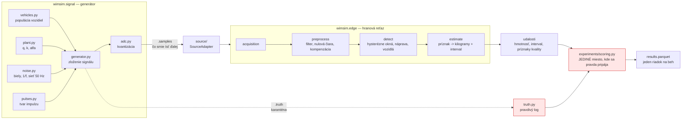
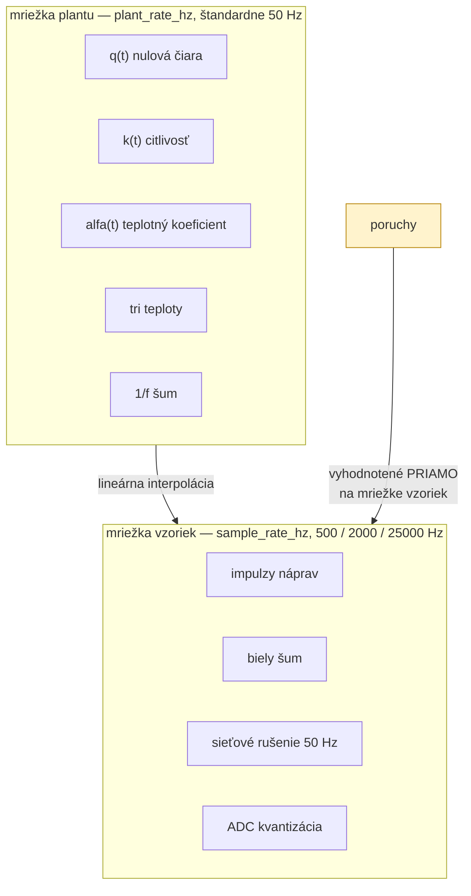
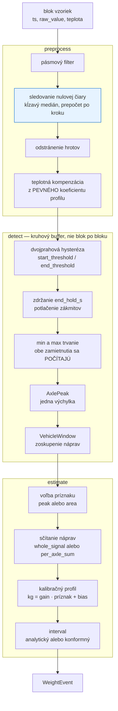
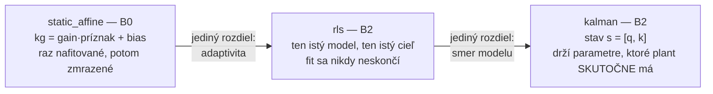
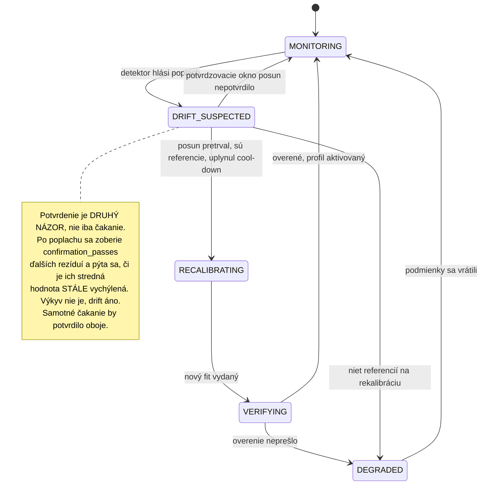
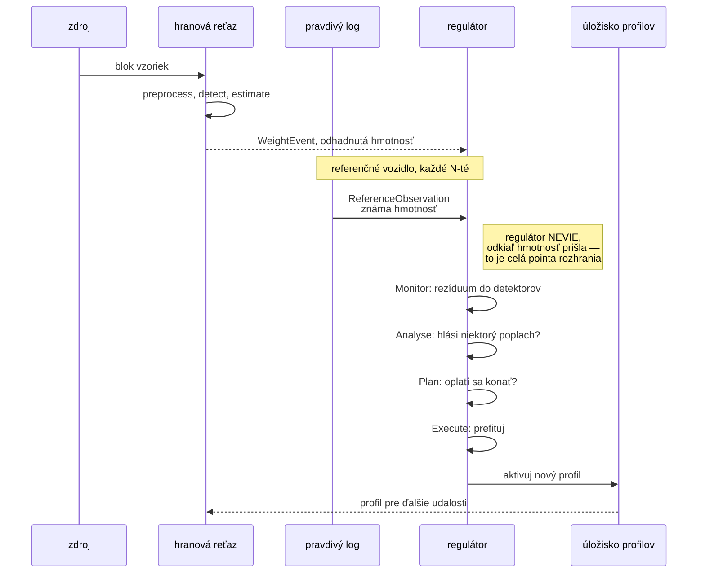

# Ako funguje simulácia

Slovenský výklad generatívneho modelu a spracovateľskej reťaze. Doplnkom je
[`experimenty-sk.md`](experimenty-sk.md), ktorý popisuje, ako sa experimenty púšťali a vyhodnocovali.
Zvyšok `docs/` je po anglicky a je normatívny — ak sa tento dokument niekde rozíde s kódom, platí
kód a `docs/signal-model.md`.

---

## 1. Na akú otázku projekt odpovedá

Váženie vozidiel za jazdy (*weigh-in-motion*, WiM) má jednu nepríjemnú vlastnosť: snímač v vozovke
sa **rozlaďuje**. Mení sa jeho nulová čiara, mení sa citlivosť, a obe sa menia s teplotou, s vekom
lepidla, s dosadnutím konštrukcie a so skokovými poruchami zosilňovača. Stanica, ktorá bola pred
pol rokom presná, dnes váži systematicky nesprávne a **nikto o tom nevie**, pretože na ceste nie je
etalón.

Projekt stavia skúšobný stend pre **samokalibráciu**: systém, ktorý rozlaďovanie sám zistí a sám
opraví, s použitím riedkeho prísunu vozidiel so známou hmotnosťou. Otázka, ktorú meria, je:

> Kedy sa riadiaca slučka oplatí, a kedy je len poistkou nad estimátorom, ktorý by si poradil aj
> sám?

Keďže reálny prístroj je jeden a nameraných je osem šesťdesiatsekundových záznamov, odpoveď musí
prísť zo simulácie. Celá hodnota simulácie teda stojí na tom, že **pravda je výstup, nikdy vstup** —
a na tom, že to je vynútené, nie sľúbené.

---

## 2. Šesť princípov, na ktorých stojí všetko ostatné

| # | princíp | ako je vynútený |
|---|---|---|
| 1 | **Pravda je výstup, nikdy vstup estimátora.** Estimátor nesmie vidieť skutočnú hmotnosť. | `tests/test_truth_isolation.py` kontroluje graf importov: nič za `SourceAdapter` nesmie importovať `wimsim.signal`. Vrstva `experiments/` je jediná výnimka a je ňou zámerne — tam sa pravda pripája k výsledkom. |
| 2 | **Jedno rozhranie pre syntetické aj reálne dáta.** | `SourceAdapter`. `SyntheticSource` a `ReplaySource` vracajú ten istý typ blokov, takže prepnutie na reálny záznam je zmena konfigurácie a nič viac. |
| 3 | **Plná proveniencia na každej hmotnosti.** | Každý riadok výsledku nesie `config_hash`, `edge_config_hash`, `git_commit`, `git_dirty`, verziu balíka. |
| 4 | **Determinizmus.** Rovnaký seed a konfigurácia ⇒ bajt po bajte rovnaký výstup. | Pomenované nezávislé RNG prúdy, viď §9. |
| 5 | **Pozorovateľnosť je dáta, nie dekorácia.** | Metriky a trasovanie sedia na švoch medzi stupňami, nie vnútri nich. |
| 6 | **Jadro estimátora je iba numpy.** Musí sa dať nasadiť na Raspberry Pi bez zmeny. | `tests/test_architecture.py` zhodí build, ak `wimsim/calibration/` začne importovať pydantic, MQTT, databázu alebo logovací framework. |

---

## 3. Celkový tok



Červené uzly sú jediné dve miesta, ktoré sa smú dotknúť pravdy. Všetko medzi `SourceAdapter` a
`events` je od nej odrezané testom na grafe importov.

---

## 4. Generatívny model

Jedna rovnica, ktorú všetko ostatné iba napĺňa:

```
x(t)     = q(t) + k(t) · Σⱼ Lⱼ · φ(t − τⱼ ; wⱼ) + n(t)
x_adc(t) = kvantizuj( x(t), adc_bits, adc_range )
```

kde

| symbol | význam | jednotka |
|---|---|---|
| `x(t)` | to, čo snímač hlási | senzorové jednotky (mV/V alebo ε) |
| `q(t)` | **nulová čiara** — kde snímač leží bez zaťaženia | senzorové jednotky |
| `k(t)` | **citlivosť** — koľko jednotiek na kilogram | jednotky/kg |
| `Lⱼ` | zaťaženie *j*-tej nápravy, vrátane dynamiky | kg |
| `φ` | normalizovaný tvar impulzu, **jednotkový vrchol** | bezrozmerné |
| `τⱼ`, `wⱼ` | čas príchodu a šírka impulzu nápravy | s |
| `n(t)` | aditívny šum | senzorové jednotky |

Úlohou estimátora je z `x` dostať späť `L`, bez toho aby poznal `q` a `k`. Riadiaca slučka existuje
preto, že `q` a `k` sa v čase menia.

### 4.1 Dve časové mriežky

Toto je jediné rozhodnutie, vďaka ktorému je 48-hodinový scenár vôbec spočítateľný.



Pomalé veličiny nenesú obsah nikde blízko 2 kHz, takže integrovať ich tam by iba znásobilo cenu
dlhého behu bez zmeny výsledku. **Poruchy sa ale neinterpolujú**: vyhodnocujú sa priamo na jemnej
mriežke, aby skoková porucha bola skutočne skok, a nie rampa široká jeden krok plantu.

### 4.2 Plant — to, čo má regulátor sledovať

```
k(t) = k₀ · (1 + α(t)·(T_sen(t) − T_ref)) · g_porucha(t)

q(t) = q₀ + W(t) + c·t + Σᵢ dᵢ·H(t − tᵢ) + β·(T_sen(t) − T_ref) + q_porucha(t)
```

Každý člen `q` sa konfiguruje a **loguje samostatne**, takže experiment sa môže pýtať „na ktorom
mechanizme driftu estimátor zlyhá“, a nie iba „driftuje to“:

- `W(t)` — Brownov náhodný pohyb nulovej čiary
- `c·t` — lineárny sklon
- `Σ dᵢ·H(·)` — Poissonovské „dosadnutia“ konštrukcie, skoky
- `β·ΔT` — teplotná väzba nulovej čiary

**`α` je sama náhodná prechádzka**, keď `alpha_walk_sigma_per_sqrt_s > 0`. To nie je detail: pri
pevnej `α` je plant statická nelinearita v meranej premennej a dopredná kompenzácia principiálne
stačí. Nech `α` bloudí a žiadna pevná kompenzácia nemôže byť správna — a to je presne situácia,
pre ktorú samokalibračný systém existuje.

### 4.3 Populácia vozidiel

Celá populácia sa vyrieši **dopredu**, pred vygenerovaním prvej vzorky. Dôvody sú o
reprodukovateľnosti: plánovanie prejazdov nesmie závisieť od toho, ako je prúd vzoriek rozsekaný do
blokov, a pravdivý log musí existovať ako úplný objekt skôr, než generovanie začne.

| veličina | rozdelenie | prečo práve toto |
|---|---|---|
| príchody | Poisson + minimálny odstup | štandardný model voľného prúdu; minimálny odstup je fyzikálne pravdivý a nutný, aby boli impulzy oddeliteľné |
| zaťaženia náprav | lognormálne, zadané strednou hodnotou a variačným koeficientom | zaťaženia sú kladné a sprava zošikmené; Gauss by v chvoste generoval **záporné** nápravy |
| rýchlosti | **orezané** normálne rozdelenie cez inverznú CDF | obyčajné orezanie by nakopilo pravdepodobnostnú hmotu na limity a ticho vyrobilo populáciu áut idúcich presne 130 km/h |
| dynamické zaťaženie | jedna oscilácia na vozidlo, zdieľaná medzi nápravami, náhodná fáza | nápravy zdieľajú karosériu; toto je dôvod, prečo `applied ≠ static` |

Z dynamického zaťaženia vyplýva **dynamická podlaha** (`dynamic_floor_kg`): chyba, ktorú si vozidlá
priniesli so sebou a ktorú žiadna kalibrácia nevie odstrániť. Všetky grafy presnosti delia MAE
touto podlahou, pretože jedine vzdialenosť nad `1.0×` je to, o čo môže metóda súťažiť.

### 4.4 Šum

Tri zložky, každá s vlastným zdôvodnením:

- **Biely** — losovaný na vzorku. `white_sigma` je smerodajná odchýlka *na vzorku*, takže ekvivalentná
  jednostranná spektrálna hustota je `white_sigma² / (fs/2)`. Zmena vzorkovacej frekvencie mení
  hustotu implikovanú pevnou sigmou — pri citovaní čísla treba povedať, ktorú z nich má človek na mysli.
- **1/f (ružový)** — superpozícia Ornstein–Uhlenbeckových relaxačných procesov s oktávovo
  rozloženými korelačnými časmi. Nie je to prekladanie krivky: flicker šum v tenzometroch,
  zosilňovačoch a lepidlách sa konvenčne modeluje presne takto. Je pásmovo obmedzený na `f_max`
  (štandardne 20 Hz), preto sa generuje na mriežke plantu a interpoluje sa nahor.
- **Sieť** — sínus s pevnou frekvenciou plus harmonické, s náhodnou fázou na beh. Je **koherentný**,
  a preto sa — na rozdiel od bieleho šumu — **nepriemeruje dolu** cez impulz. To je dôvod, prečo sa
  meria oddelene od bielej podlahy: jediná smerodajná odchýlka cez záznam počíta brum ako šum, a
  presne tak sa do konfigurácie dostala `white_sigma`, ktorá brum ticho pohltila.

### 4.5 Tvary impulzov

Všetky sú škálované na **jednotkový vrchol**. To je modelovacie rozhodnutie, nie detail: snímač pod
valiacou sa pneumatikou vidí silu približne rovnú zaťaženiu nápravy po dobu, kým kontaktná plocha
pokrýva snímač. Vrcholová sila teda sleduje zaťaženie a je nezávislá od rýchlosti, kým **trvanie**
impulzu je `kontaktná_plocha / rýchlosť` a **plocha** impulzu je `zaťaženie · plocha / rýchlosť`.

Z toho plynie experimentálna otázka, ktorú projekt zámerne nepredrozhoduje: *vrchol* je
rýchlostne invariantný, ale vidí plnú šírku pásma šumu; *plocha* priemeruje šum dolu, ale potrebuje
odhad rýchlosti, ktorý jeden snímač nevie poskytnúť.

| tvar | čo modeluje |
|---|---|
| `gaussian` | idealizácia, symetrická, bez chvosta |
| `emg` | exponenciálne modifikovaný Gauss — chvost, ktorý reálne vozovkové snímače ukazujú, ako sa konštrukcia za nápravou uvoľňuje |
| `ringing` | Gauss plus tlmený sínus spustený v okamihu nárazu — konštrukčný mód; toto je tvar, ktorý robí naivné hľadanie vrcholu ťažkým |
| `influence_line` | orezaná parabola. **Iný prístroj, nie iná pneumatika** — tenzometer na nosnom prvku, ktorého šírka je daná konštrukciou, nie stopou pneumatiky, a je rádovo sekundu široká |

---

## 5. Hranová reťaz



**Sledovanie nulovej čiary je horúca cesta celého projektu.** Prepočítava sa každých
`zero_stride` vzoriek — na 16-hodinovom scenári 230 000-krát — a profilovanie ukázalo, že zaberalo
**61 %** času behu. Viď §10.

Detektor pracuje na **kruhovom bufferi**, nie po blokoch. Nie je to optimalizácia: okno sa môže
otvoriť v jednom bloku a zavrieť o tri bloky neskôr, spätná chôdza na začiatok výchylky môže
prejsť cez hranicu a integrál plochy s okrajom potrebuje vzorky spred otvorenia okna. Výsledky by
inak záviseli od toho, kde sa prúd náhodou rozsekal — a test
`test_results_do_not_depend_on_block_size` hovorí, že nesmú.

---

## 6. Estimátory

Tri priečky rebríka, zámerne malé kroky, aby bol rozdiel pripísateľný:



**`static_affine`** je základná čiara. Nafituje priamku a zmrazí ju.

**`rls`** — rekurzívne najmenšie štvorce s exponenciálnym zabúdaním. Rovnaký model, rovnaký cieľ,
rovnaký smer predikcie ako B0; jediný rozdiel je, že fit nikdy nekončí. Tá izolácia je pointa: keď
RLS poráža základnú čiaru na `S4_step_fault`, výsledok je pripísateľný adaptivite a ničomu inému.

```
e     = y − φᵀθ                       apriórne rezíduum
g     = Pφ / (λ + φᵀPφ)                zisk, v smere informatívnosti dát
θ    ← θ + g·e
P    ← (P − g·(φᵀP)) / λ
```

**`kalman`** otáča problém: namiesto regresie kilogramov na príznak drží stav `s = [q, k]`, teda
nulovú čiaru a citlivosť na strane snímača, s procesným modelom náhodnej prechádzky na hodinách a
meracou rovnicou `x = [1, m]·s + v`. Predikcia je potom `m̂ = (x − q)/k`.

Existujú dve parametrizácie a obe sú potrebné, preto sú obe vystavené: *smer predikcie*
(`gain`/`bias`, kg na senzorovú jednotku) a *strana snímača* (`q`/`k`).

### 6.1 Konformné intervaly

Split conformal prediction — interval, ktorý nežiada od rezíduí, aby boli gaussovské. Dôvod je
nameraný, nie učebnicový: analytický interval dal empirické pokrytie 0,906 oproti nominálnym 0,95
na čistých syntetických dátach, a 0,750 po zapnutí sieťového brumu — pretože brum je koherentný,
takže chyba, ktorú pridáva, je **štruktúrovaná**, a interval postavený na smerodajnej odchýlke ju
ocení nesprávne.

---

## 7. Detekcia driftu a riadiaca slučka

### 7.1 Štyri detektory

Štyri, pretože **zlyhávajú rozdielne**, a experiment hlási aj mieru falošných poplachov, aj mieru
nezachytených udalostí. Asymetria týchto dvoch cien je celé návrhové obmedzenie: nezachytená
detekcia je váha, ktorá je hodiny ticho zlá, a falošný poplach je rekalibrácia, ktorú stanica
nepotrebovala, ktorá spotrebuje referenčné vozidlá a nakrátko kalibráciu **zhorší**.

| detektor | na čo je stavaný | ako zlyháva |
|---|---|---|
| `CUSUM` | trvalý posun strednej hodnoty | zmena rozptylu ho spustí, z nesprávneho dôvodu |
| `PageHinkley` | to isté, voči bežiacemu priemeru | pomalší na rampe, ktorá si ťahá vlastnú referenciu |
| `ADWIN` | akákoľvek zmena priemeru, s vlastnou voľbou okna | potrebuje, aby buffer preklenul zmenu |
| `KSWindow` | akákoľvek zmena **rozdelenia** | potrebuje dve plné okná, preto je najpomalší |

### 7.2 MAPE-K automat



Mapovanie na MAPE-K: **Monitor** berie rezíduum na prejazd a kŕmi detektory. **Analyse** sa pýta,
či niektorý z nich hlási poplach. **Plan** rozhoduje, či sa oplatí konať — pretrval poplach, sú
referenčné vozidlá, uplynul cool-down, smie táto stanica rozhodovať sama. **Execute** prefituje a
odovzdá nový stav. **Knowledge** je úložisko profilov, ktoré vlastní volajúci; samotná trieda
regulátora nedrží žiadnu perzistenciu a nerobí IO, pretože `calibration/` sa musí dať nasadiť na
Pi.

### 7.3 Uzavretá slučka na jeden prejazd



**Kde vstupuje pravda a prečo to je dovolené.** Regulátor potrebuje rezíduá a rezíduum potrebuje
referenčnú hmotnosť. V teréne tá hmotnosť príde z vozidla flotily s transpondérom alebo z mostovej
váhy o kilometer ďalej; tu príde z pravdivého logu, prečítaná **modulom `experiments/`**. To je
celý zmysel rozhrania `ReferenceObservation`: `calibration/` dostane hmotnosť a nevie zistiť,
odkiaľ prišla, a `tests/test_truth_isolation.py` dokazuje, že si po ňu nikdy nesiahne sám.

---

## 8. Vyhodnotenie

`experiments/scoring.py` je jediná vrstva, ktorá smie spojiť odhady s pravdou.

**Párovanie je miesto, kde sa vyhodnotenie ticho pokazí.** Detektor hlásiaci každé vozidlo o 40 ms
neskôr zmeral **každé** vozidlo; matcher trvajúci na presných časových značkách by hlásil úplné
zlyhanie a potom počítal strednú chybu nad prázdnou množinou. Udalosti sa preto párujú s prejazdmi
podľa **prekryvu intervalov** s toleranciou, jedna k jednej, od najbližšieho — a čo sa nespáruje,
hlási sa ako nezachytené alebo falošne pozitívne, nie zahodí sa.

Hlási sa okrem iného: `mae_kg`, `rmse_kg`, `bias_kg` (znamienkové!), `mape`, `coverage` proti
nominálnej hodnote, `dynamic_floor_kg`, `match_recall`, detekčné `recall`, `false_alarms_per_hour`,
`mean_detection_delay_s`, `reconverge_s` a počet rekalibrácií.

Dve definície, ktoré sú ťažké naschvál:

- **Rekonvergencia vyžaduje, aby sa chyba vrátila a zostala.** Kĺzavý medián cez okno, nie jeden
  šťastný prejazd uprostred poruchy. A štatistika je **znamienkový** medián, nie medián absolútnej
  chyby: kalibračná porucha je systematický posun a `|chyba|` sa sotva pohne, keď sa široké
  symetrické rozdelenie posunie nabok.
- **Detekcia sa musí stať po poruche.** Uznať poplach, ktorý zaznel predtým, by umožnilo detektoru,
  ktorý alarmuje neustále, skórovať dokonale.

---

## 9. Determinizmus

Nedosahuje sa „podávaním seedu dookola“. Každý stochastický komponent dostane **vlastný prúd**
odvodený z behového seedu a z mena komponentu:

```python
rng = streams(seed).get("noise.pink")
```

Z toho plynú dve vlastnosti:

- **Nezávislosť od poradia.** Pridanie nového stochastického komponentu, alebo odobratie iného
  počtu hodnôt z jedného z nich, nemôže posunúť čísla, ktoré vidí ktorýkoľvek iný. So zdieľaným
  generátorom — alebo so `SeedSequence.spawn()`, ktorý je pozičný — by posunulo.
- **Reprodukovateľnosť naprieč verziami kódu.** Detský seed je BLAKE2b odtlačok mena komponentu,
  nie Pythonov solený `hash()`, takže je stabilný naprieč procesmi a vydaniami.

Práve toto robí porovnanie „slučka zapnutá vs vypnutá“ platným: obe ramená bežia nad **bajt po
bajte identickým** prúdom vzoriek, takže sa líšia presne v jednej veci, a rozdiel sa dá párovať
podľa seedu a testovať Wilcoxonovým párovým testom.

---

## 10. Výkon

Profilovanie behu ukázalo, že **61 %** času sedelo v `Preprocessor._track_zero`, a väčšina z toho
nebola aritmetika: sledovač nulovej čiary počítal štyri poradové štatistiky cez `np.median` plus
`np.quantile`, čo **dvakrát** particionuje to isté 15 000-vzorkové okno a potom strávi viac času v
Pythonovskom obale `np.quantile` (`_get_indexes`, `_lerp`, `_ureduce`, `issubdtype`) než v samotnej
particii — lebo tá réžia je **na volanie** a pole kvantilov má tri prvky.

Teraz jedna particia obsluhuje všetky štyri, s presne reprodukovaným `_lerp` vrátane jeho vetvy nad
`t ≥ 0,5`. Výsledok: **61,1 s → 38,7 s, teda 1,58×**.

Namerané časy všetkých sweepov a dôvod, prečo paralelizmus na tomto stroji nepomáha, sú v
[`experimenty-sk.md` §6](experimenty-sk.md#6-časy-behu).

Rozhodujúce je, že je to **bit po bite identické**, nie približne rovnaké. Každý sweep v exporte sa
porovnáva so sweepmi, ktoré bežali pred existenciou tohto kódu, a rozdiel jedného ulpu v odhade
nulovej čiary by sa propagoval do inej hmotnosti. Overené trojako: 4 000 náhodných okien naprieč
oboma paritami dĺžky, ťažkými remízami, konštantnými oknami a rozptylom jedného denormálu; celý
16-hodinový beh, ktorého 48 výsledkových stĺpcov vrátane hashov konfigurácie vyšlo zhodne; a
existujúce testy determinizmu.

---

## 11. Knižnice

| knižnica | verzia | na čo |
|---|---|---|
| **numpy** | 2.5.2 | celá číselná práca. Jadro `calibration/` nesmie importovať nič iné — vynútené testom |
| **scipy** | 1.18.1 | `scipy.signal` pre filtre a Welchov odhad PSD; `scipy.stats` pre orezané normálne rozdelenie a Wilcoxonov test |
| **pandas** | 3.0.5 | tabuľky výsledkov, dlhý formát, agregácie |
| **pyarrow** | 25.0.1 | čítanie a zápis parquetu — formát pre vzorky, pravdu aj výsledky |
| **matplotlib** | 3.11.1 | obrázky, 300 dpi, bez časovej značky v metadátach, aby sa dali diffovať |
| **pydantic** | 2.13.4 | validácia konfigurácie a transportných modelov. **Nikdy nie v jadre estimátora** |
| **pyyaml** | ≥6.0 | konfigurácie staníc, scenárov, estimátorov a experimentov |
| **typer** | ≥0.12 | rozhranie `wimsim` |
| paho-mqtt, psycopg, SQLAlchemy, Alembic | — | transport a úložisko (fáza 3); pre samotnú simuláciu sa nepoužívajú |
| pytest, pytest-cov, ruff | — | 1013 testov, statická kontrola |

Python 3.13.13. Celý balík má približne 22 200 riadkov.

---

## 12. Tri úrovne prístroja

Simulácia nemodeluje jeden snímač, ale tri konfigurácie, a rozdiel medzi nimi nie je nastavenie —
sú to rôzne prístroje:

| stanica | vzorkovanie | čo modeluje |
|---|---|---|
| `default` | 2 000 Hz | snímač merajúci kontaktnú silu pod pneumatikou; impulzy milisekundy široké |
| `endurance` | 500 Hz | to isté, dlhé behy, lacnejšia mriežka |
| `cintron_platform` | 25 000 Hz | **reálna inštrumentovaná plošina** — dvojica tenzometrov na nosnom prvku, odozva je vplyvová čiara konštrukcie, rádovo sekundu široká |

Hlavička `configs/stations/cintron_platform.yaml` dôsledne označuje každý parameter ako
`measured`, `TOLD`, `ESTIMATED`, `ASSUMED` alebo `INFERRED` — vrátane priznania, že rýchlosť
prejazdu nebola nikdy odmeraná a že konštanta `k0` bola raz chybná o faktor tisíc. Tá chyba sa
našla až tým, že sa scenáre po prvýkrát pustili na tejto stanici a nedetegovali **nič**.
